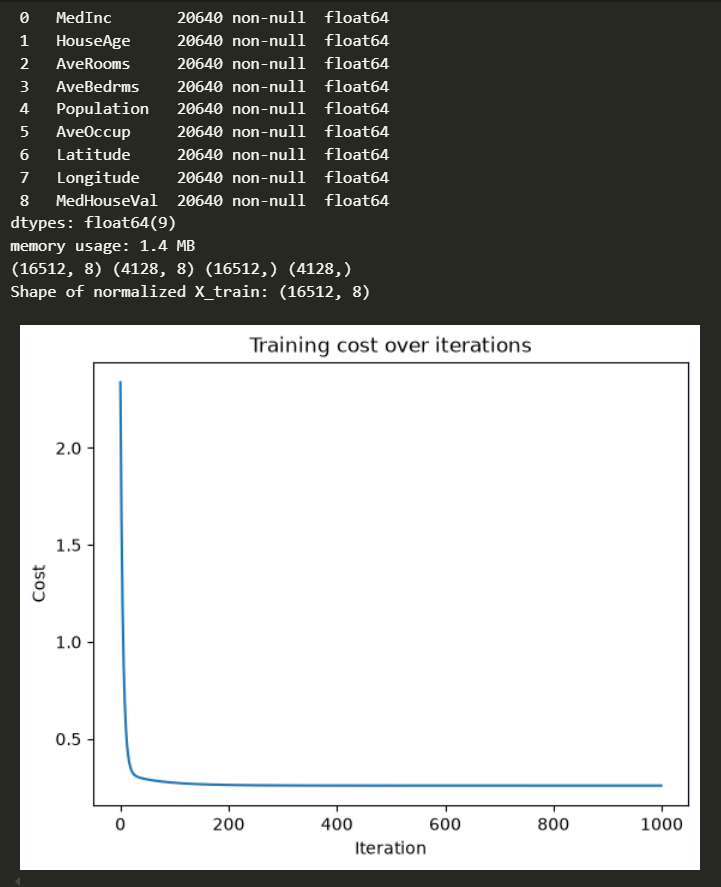
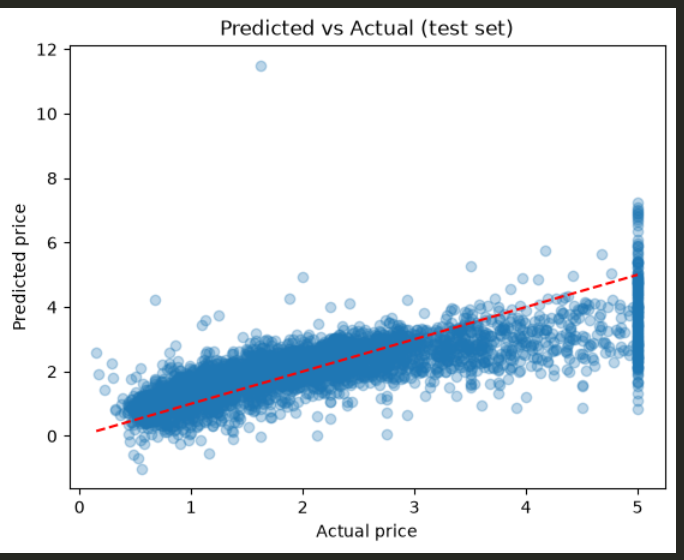
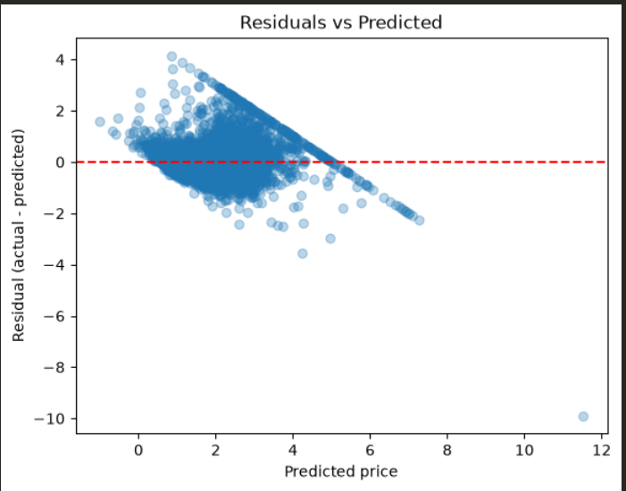

# Project 1 Report on California Housing: Linear Regression from Scratch

## What I did

I applied my own from-scratch linear regression implementation (predict, cost, gradient, gradient descent) to a real dataset: California housing prices, 20,600 houses, 8 features (median income, house age, rooms, population, location, etc).

Steps, in order:
1. Loaded the dataset with `sklearn.datasets.fetch_california_housing`
2. Split into train (80%) and test (20%) sets **before** any normalization, to avoid data leakage
3. Normalized features using z-score normalization , computed mean/std on the training set only, then applied those same numbers to the test set
4. Trained my own `gradient_descent` function on the normalized training data for 10000 iterations
5. Evaluated using R² on both train and test sets
6. Plotted the cost curve, predicted-vs-actual, and residuals to check the model's behavior

## Where I got stuck, and how I got out

- **Confusion between `w` and `b`.** Cleared up on my own: `w` is a vector (one weight per feature, shape `(8,)`), `b` is a single scalar shared across all predictions.
- **`normalize` function silently dropping `mu`/`sigma`.** My first version only returned `X_norm`, but I needed `mu` and `sigma` later to normalize the test set the same way. Fixed by returning all three from the function.
- **Called `gradient_descent` on the wrong data** on my first attempt I passed the raw, unsplit, unnormalized `X` instead of `X_train_norm`, and was also missing the `y` argument. Fixed by calling it correctly on `X_train_norm` and `y_train.values`.
- **`.values` used in the wrong place.** Tried calling `.values` on `X_train_norm`, which is already a plain numpy array (not a pandas object), so it doesn't have `.values`. Only pandas Series/DataFrames (like `y_train`) need that conversion. Fixed by dropping `.values` from the numpy array and keeping it only on the pandas object.

None of these were conceptual misunderstandings , they were the normal kind of bugs that show up when translating a correct mental model into working code across multiple functions. Each one was diagnosed and fixed by checking data types and shapes at each step.

## Results

| Metric | Train | Test |
|---|---|---|
| R² | 0.6126 | 0.5757 |

The train and test R² are close to each other (0.61 vs 0.58) which means the model is **not overfitting**. It learned a real pattern that holds up on houses it never saw during training, rather than memorizing the training data.

An R² of ~0.58 means the model explains about 58% of the variation in house prices using only 8 linear features. That's a reasonable result for plain linear regression on this dataset , not perfect, because house prices don't relate to these features in a perfectly straight-line way.

## What the graphs are telling me

### Cost curve

The cost dropped sharply within the first ~50 iterations and flattened out by around 200, staying flat for the remaining 800. This means gradient descent converged properly ; the learning rate was appropriate (not too big to overshoot, not too small to stall), and training ran for enough iterations to reach a stable minimum.

### Predicted vs Actual

Points close to the red dashed diagonal line are well-predicted. Most of the data (roughly actual price 1–4, in units of $100k) sits reasonably close to that line, which matches the R² score which is decent but not great fit.

Two things stand out:
- **A vertical line of points at exactly actual = 5.** This is a known artifact of this dataset , house values above 500,000 (Dollars)  were capped atexactly $500,000 during data collection, not measured beyond that. My model doesn't know about this artificial ceiling, so it predicts a range of values for houses that all share the same capped actual value. This drags down the R² a little, but it's a limitation of the dataset, not a bug in my model.
- **One clear outlier** near actual ≈ 1.6, predicted ≈ 11.5 , a single house where the model badly overpredicted. Likely one example with unusual feature values (e.g. an extreme rooms-per-household ratio) that pushed the linear model to an unreasonable output. Worth noting, not worth fixing , a single outlier like this doesn't change the overall story.

### Residuals vs Predicted

A "healthy" residual plot looks like a flat, random cloud centered on zero, with no visible pattern. Mine isn't quite that , there's a visible downward trend: as predicted price increases, residuals drift from positive (underpredicting cheap houses less, actually mildly overpredicting them) to negative (underpredicting expensive houses).

**What this means:** my model systematically **underpredicts expensive houses and overpredicts cheap houses.** This is a direct consequence of using a straight-line model. Linear regression has to pick one constant slope across the entire price range , but the real relationship between features like income and price likely isn't constant. A given increase in income probably adds more value to an expensive house than a cheap one (location premiums, luxury effects, etc). A straight line can't bend to capture that curve, so it ends up being wrong in a consistent direction at both extremes.

## What this tells me about my model and the dataset

- **My implementation is correct.** No leakage, no overfitting, cost curve converges cleanly, R² is in the expected range for this dataset and model type.
- **Linear regression has a real, structural limitation here**: it can only draw one straight-line relationship between features and price, but the true relationship bends , especially at the high end of the price range. This isn't something more training iterations or a different learning rate would fix; it's a limitation of the model class itself.
- **The $500k price cap is a dataset artifact**, not a modeling failure , worth knowing about but not something to try to "fix" in the model.
- This is a natural motivation for why more flexible models (like the neural network I'm building next) can do better on this kind of data , they aren't restricted to a single straight line and can bend to fit non-linear patterns like this one.

## Final numbers to remember
- Test R²: **0.576**
- Train R²: **0.613**
- Gap between train/test: **~0.04** whic  h shows no meaningful overfitting
