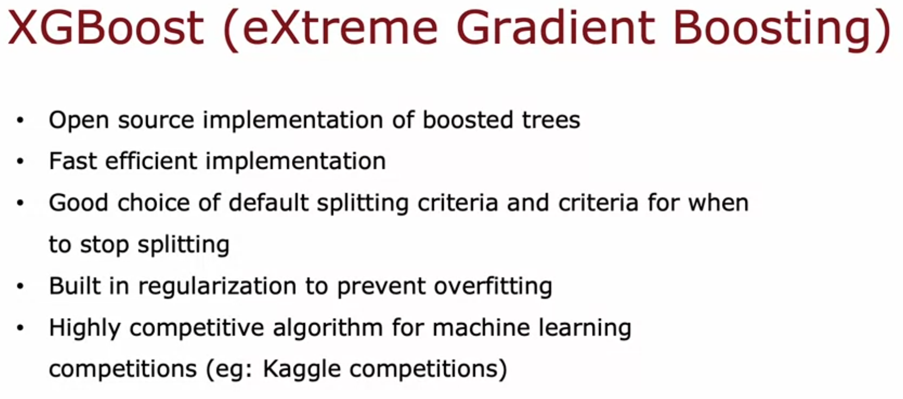
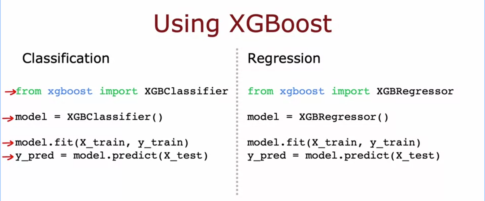

# Boosting and XGBoost

## The idea behind boosting
This is a modification to the bagged decision tree algorithm to make it work better.

- In the normal loop, every training set is generated the same way, sampling with replacement from all m examples with equal probability
- Boosting changes this from the second tree onward, giving higher probability of picking examples that the trees built so far are still getting wrong
- Compared to deliberate practice while learning piano, instead of replaying the whole piece, you repeat just the parts you are not yet good at, this is more efficient

## How it actually works
After training a tree, we check how it does on the original training set, not a resampled one.

- Go through all the original examples and mark which ones the current ensemble gets right or wrong
- When generating the next training set, examples that are still misclassified get a higher chance of being picked
- This repeats for all B trees, each new tree focuses more on what the previous ones are still weak on
- The exact math for how much to boost the probability is complex, but not something we need to implement ourselves

## XGBoost
XGBoost (extreme gradient boosting) is the most widely used implementation of boosted trees today.

- Fast and efficient, open source, easy to use
- Comes with good default choices for splitting criteria and stopping criteria
- Has built in regularization to prevent overfitting
- Very competitive in ML competitions like Kaggle, along with deep learning
- Does not actually do sampling with replacement, instead assigns different weights to different training examples, same intuition, more efficient implementation

## Using XGBoost in code
Usage is basically the same for classification and regression, just swap the class.

- Classification: import XGBClassifier, create the model, then model.fit(X_train, y_train), then model.predict(X_test)
- Regression: same steps but with XGBRegressor instead

