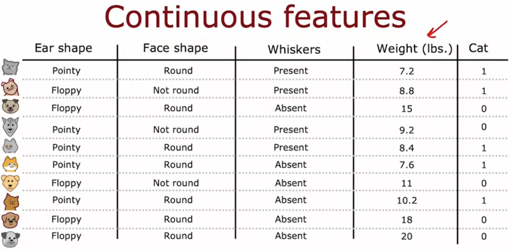
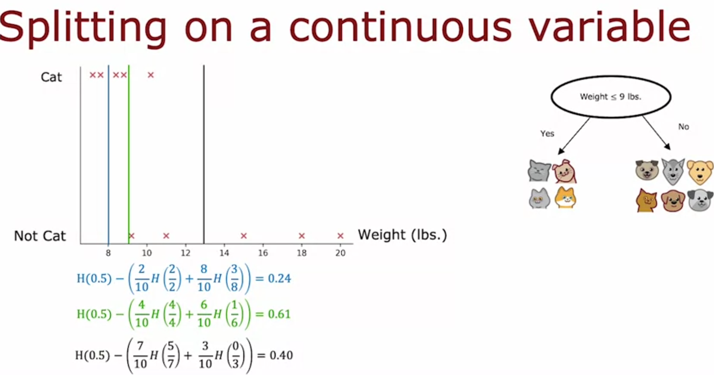

# Decision Trees with Continuous Features

added weight (lbs) as a feature now, not just binary stuff like ear shape. so how does splitting even work when the feature is a number, not a category?

## the setup

plot weight on x axis, cat/not cat on y axis. dataset has cats mostly lighter, dogs mostly heavier, but overlap exists (some cats heavier than some dogs).

question: where do you draw the line?

## the idea
pick a threshold value, split into "weight <= threshold" vs "weight > threshold". but which threshold? try a bunch of them, compute info gain for each, pick whichever gives highest.

tried 3 thresholds in the example:

**<= 8:** left = 2 cats (2/2), right = 3 cats out of 8 (3/8)
info gain = H(0.5) - [(2/10)H(2/2) + (8/10)H(3/8)] = **0.24**

**<= 9:** left = 4 cats out of 4 (4/4, pure!), right = 1 cat out of 6 (1/6)
info gain = H(0.5) - [(4/10)H(4/4) + (6/10)H(1/6)] = **0.61**

**<= 13:** left = 5 cats out of 7, right = 0 out of 3
info gain = **0.40**

9 wins by a mile. makes sense visually too, that's roughly where cats stop and dogs start clustering.

## how do you pick which thresholds to even try
sort all examples by weight, take midpoints between consecutive sorted values. 10 examples = 9 candidate thresholds. test each one, keep the best.

## putting it together
compute info gain for weight (using its best threshold) same as you'd compute it for ear shape, face shape, whiskers. compare ALL of them (categorical features + this one continuous feature with its best threshold). whichever gives highest info gain wins the split at that node.

in this example weight <= 9 (info gain 0.61) beat every other feature, so root splits there.

after that split, recurse as usual, build subtrees on the two resulting groups.

## what this means
continuous feature just becomes a yes/no question too, "is weight <= T?", you just have to search over T first to find the best cutoff before treating it like any other binary split.

## what's next
this is it for classification trees. next (optional) topic: regression trees, predicting a number instead of a category.

*Source: Andrew Ng, Machine Learning Specialization*
