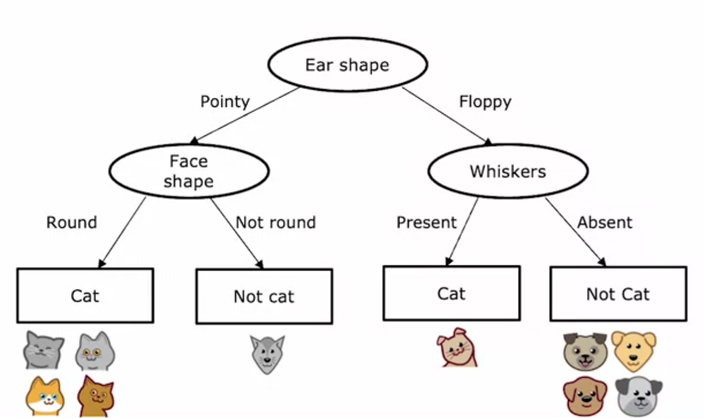
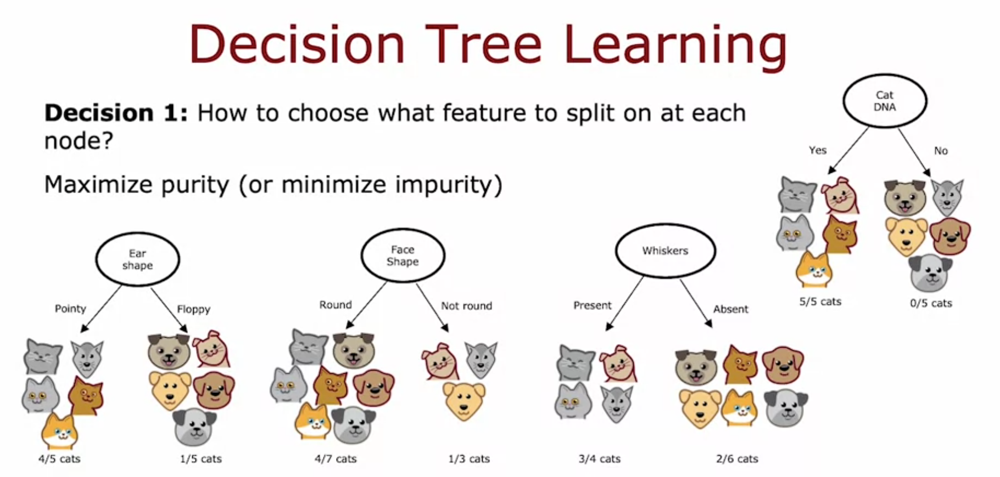
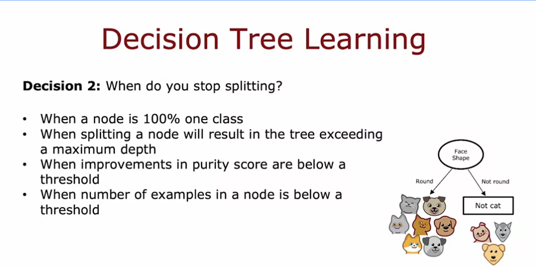

# decision tree learning process

how you actually build a decision tree from a training set (cat vs dog example, 10 examples).

## the process

1. root node: pick a feature to split on first. example picks ear shape → 5 pointy left, 5 floppy right
2. left branch: pick another feature for just those 5. picks face shape → 4 round (all cats) left, 1 not round (not cat) right. both pure → make leaf nodes, stop splitting here
3. right branch: same idea, 5 examples (1 cat, 4 dogs). splits on whiskers → present = 1/1 cat, absent = 0/4 cats. both pure again → leaf nodes

final tree:

so basically: pick feature → split → check if pure → if not pure, repeat on that branch → if pure, leaf node.

## decision 1: which feature to split on

goal = maximize purity (minimize impurity) of the resulting subsets.

made-up example: if we had a "cat DNA" feature, splitting on it gives 5/5 cats one side, 0/5 cats other side → perfectly pure, ideal feature. we don't have that irl though.

with real features at root node:
- ear shape → 4/5 cats (pointy) vs 1/5 cats (floppy)
- face shape → 4/7 cats (round) vs 1/3 cats (not round)
- whiskers → 3/4 cats (present) vs 2/6 cats (absent)

algorithm picks whichever split gets closest to pure subsets. exact method = entropy (next video).

## decision 2: when to stop splitting

stop when:
- node is 100% one class (natural leaf)
- splitting would push tree past max depth (max depth = param you set, root = depth 0)
- purity improvement from splitting is too small (not worth it)
- node has too few examples left to bother splitting further

why bother stopping early: keeps tree smaller + reduces overfitting risk.

note: decision tree algo feels kind of like a pile of separate rules bolted together (different researchers added different criteria over time) rather than one clean elegant idea. works well anyway.

next video: entropy, way to actually measure impurity so decision 1 isn't just eyeballing fractions.
