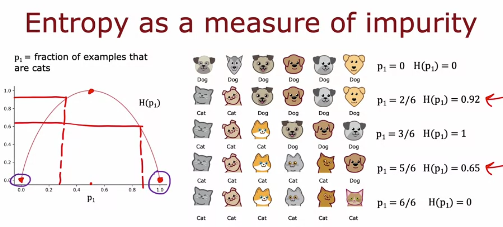
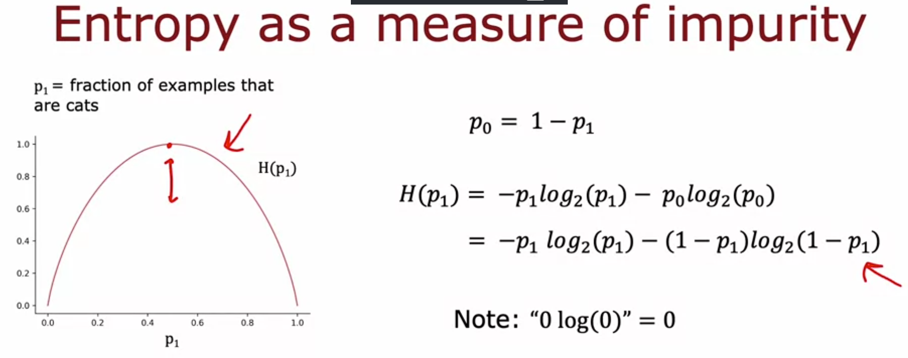

# Entropy as a Measure of Impurity

## Why we need this
When building a decision tree we need some way to measure how "mixed up" a set of examples is. If a group is all cats, that's pure. If it's all dogs, that's also pure. But if it's a mix, we need a number that tells us how mixed it is. That's what entropy does.

## Definition

Let **p1** = fraction of examples in the set that are cats (the positive class, label = 1).

Example: 3 cats and 3 dogs out of 6 examples.

p1 = 3/6 = 0.5

The entropy function is written as **H(p1)**, and it's plotted as a curve that:
- starts at 0 (when p1 = 0, all dogs)
- rises to a peak of 1 (when p1 = 0.5, a perfect 50/50 mix)
- comes back down to 0 (when p1 = 1, all cats)

So entropy is highest exactly when the set is most mixed, and lowest when the set is pure (all one class or the other).

## Worked examples from the images

Note how 2/6 (0.92) is actually more impure than 5/6 (0.65), even though both are "not 50/50." That's because 2/6 is closer to the 0.5 peak than 5/6 is. Impurity depends on distance from the 50/50 point, not just which class has more examples.

## The actual formula

First define p0 as the fraction of examples that are NOT cats:

p0 = 1 - p1

Then entropy is:

H(p1) = -p1 * log2(p1) - p0 * log2(p0)

or written fully in terms of p1 only:

H(p1) = -p1 * log2(p1) - (1 - p1) * log2(1 - p1)

**Why log base 2 and not natural log?** Just so the peak of the curve lands exactly on 1, which makes the numbers easier to read. Using ln would still work, it would just scale the curve vertically and the peak wouldn't be a clean number anymore.

## Handling 0 log(0)

If p1 or p0 is 0, then the formula would technically involve 0 * log2(0), and log2(0) is undefined (negative infinity). By convention we just define:

0 * log(0) = 0

This is what makes pure sets correctly give an entropy of exactly 0 instead of breaking the formula.

## Side note
The entropy formula looks similar to logistic loss from the earlier course. There's a real mathematical reason for that, but it's not something we need to dig into for decision trees, just apply the formula as is.

## Gini as an alternative
Entropy isn't the only impurity measure. Some libraries use the **Gini criteria** instead, which has the same general shape (0 to 1 back to 0) and works about as well. Entropy is just simpler to focus on for now.

## Summary
- Entropy H(p1) measures impurity of a set of examples
- Ranges from 0 (pure) to 1 (max impurity at 50/50) back to 0 (pure the other way)
- Formula: H(p1) = -p1*log2(p1) - (1-p1)*log2(1-p1)
- 0log(0) is defined as 0 by convention
- Next step: use entropy to decide which feature to split on at each node of the tree
