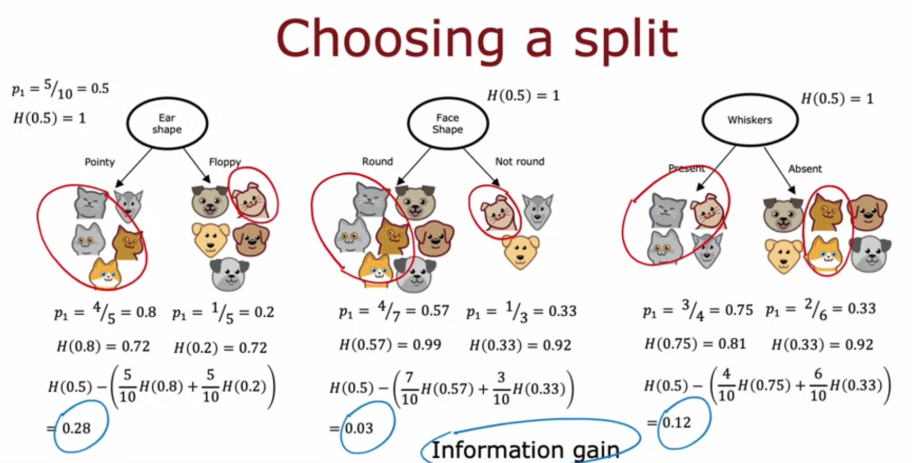
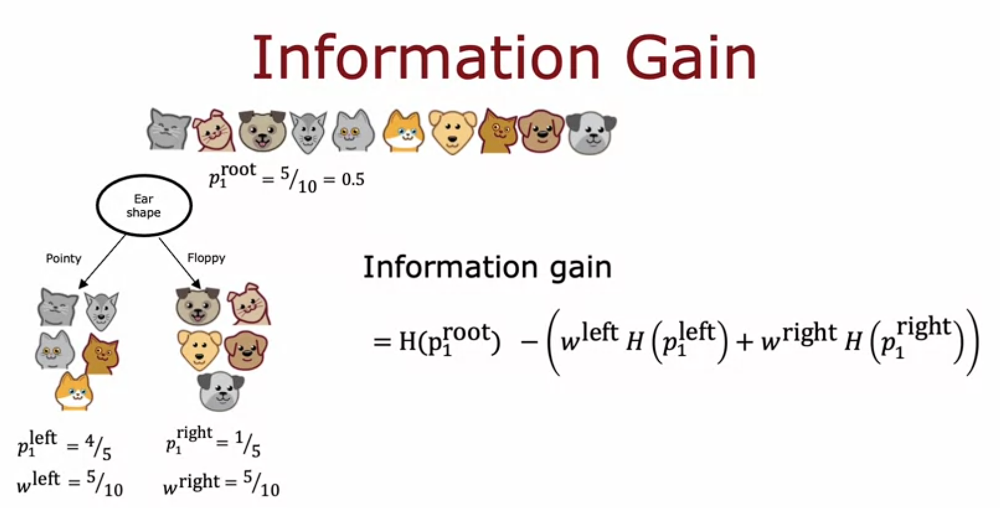

# Information Gain

Week notes from Andrew Ng ML Specialization. Last lecture said decision trees pick splits that maximize purity. This lecture gives the actual formula: information gain.

## Quick Reminder on Entropy

Entropy H(p) measures impurity. p is the fraction of positive examples (cats) in a set. H(0.5) is the worst case, maximum impurity, a perfect 50/50 mix. H(0) and H(1) are both 0, meaning perfectly pure (all one class). Every split produces a left and right subset, each with its own p and therefore its own entropy value.

## The Problem: Comparing Splits

At the root node we have three candidate features to split on: ear shape, face shape, whiskers. Each split produces two subsets, each with its own entropy.

**Ear shape:** left subset has p1 = 4/5 = 0.8, entropy H(0.8) = 0.72. Right subset has p1 = 1/5 = 0.2, entropy H(0.2) = 0.72.

**Face shape:** left p1 = 4/7 = 0.57, H = 0.99. Right p1 = 1/3 = 0.33, H = 0.92.

**Whiskers:** left p1 = 3/4 = 0.75, H = 0.81. Right p1 = 2/6 = 0.33, H = 0.92.

Each split gives you two numbers. That's annoying because you cannot directly compare six numbers across three options and pick a winner. You need one number per split.

## Step 1: Weighted Average of Entropy

The fix is to combine the left and right entropy into a single number using a weighted average, weighted by how many examples went to each side.

The reasoning: a branch with high entropy and lots of examples is worse than a branch with high entropy and only a couple examples. Size matters, so you weight accordingly.

For ear shape: 5 out of 10 examples went left, 5 went right. So the weighted average is:

$$\frac{5}{10}H(0.8) + \frac{5}{10}H(0.2)$$

Same idea for the other two splits, using their own example counts (7/10 and 3/10 for face shape, 4/10 and 6/10 for whiskers).

## Step 2: Information Gain (Reduction in Entropy)

Instead of stopping at the weighted average, decision tree convention subtracts it from the entropy at the root node before splitting. This subtraction doesn't change which feature wins, it's just the standard way it's computed.

At the root, before any split, we have 5 cats out of 10, so p1_root = 0.5, and H(0.5) = 1. This is the maximum possible entropy, meaning the root is a totally mixed group before we do anything.

**Information gain = entropy before split − weighted entropy after split**

$$\text{Info Gain} = H(p_1^{root}) - \left(w^{left}H(p_1^{left}) + w^{right}H(p_1^{right})\right)$$

Plugging in the numbers from the lecture:

Ear shape: 1 − (5/10 × 0.72 + 5/10 × 0.72) = **0.28**

Face shape: 1 − (7/10 × 0.99 + 3/10 × 0.92) = **0.03**

Whiskers: 1 − (4/10 × 0.81 + 6/10 × 0.92) = **0.12**

Ear shape has the highest information gain, so it wins. That's why the root node splits on ear shape, matching what was chosen back in the tree-building example.

## Why Bother Subtracting From the Root Entropy

Just comparing the weighted averages would already tell you which split is best, since ear shape still has the lowest weighted average entropy. So why go through the extra subtraction step?

Because information gain gives you something the raw weighted average doesn't: a meaningful zero point. It tells you exactly how much entropy you reduced by making this split, not just the absolute entropy that remains.

This matters for one of the stopping criteria from the previous lecture: if the reduction in entropy is too small, don't bother splitting. Information gain is literally the number you check against that threshold. A face shape split with information gain of only 0.03 barely improves anything and might not be worth the extra tree complexity.

## The General Formula

Written formally using ear shape as the example:

- p1^root = fraction of positive examples at the root node before splitting (5/10 = 0.5)
- p1^left = fraction of positive examples in the left branch after splitting (4/5)
- p1^right = fraction of positive examples in the right branch after splitting (1/5)
- w^left = fraction of all root examples that went left (5/10)
- w^right = fraction of all root examples that went right (5/10)

$$\text{Information Gain} = H(p_1^{root}) - \left(w^{left}H(p_1^{left}) + w^{right}H(p_1^{right})\right)$$

This formula generalizes to any node, not just the root. At any point in the tree, you compute this for every candidate feature and pick whichever gives the highest information gain.

## The Full Picture

Combined with the previous lecture, the algorithm is now complete conceptually:

At each node, calculate information gain for every candidate feature, pick the one with highest gain, split on it. Stop when purity is high enough, max depth is hit, information gain is too small, or too few examples remain. That is decision tree learning.

---

*Source: Andrew Ng, Machine Learning Specialization*
