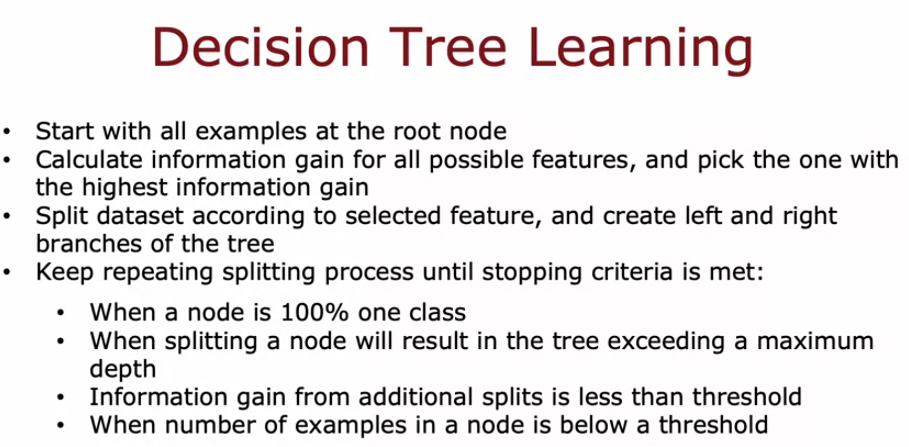
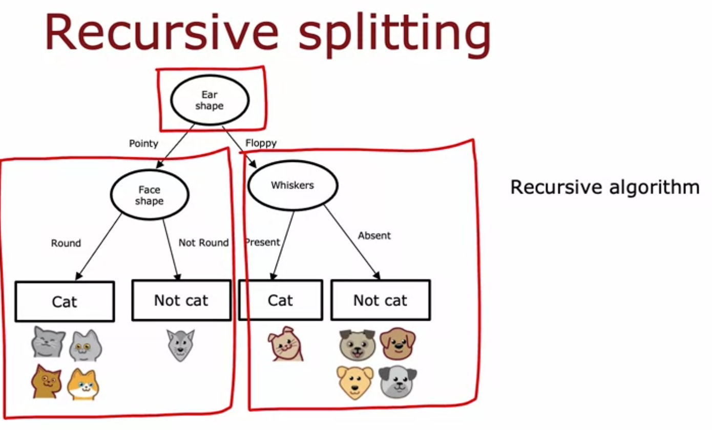

# Building the Full Decision Tree: Recursive Splitting

Week notes from Andrew Ng ML Specialization. Previous lecture gave the formula for picking one split. This lecture puts it together into the full algorithm for building the whole tree.

## The Overall Algorithm

Start with all training examples sitting at the root node. Calculate information gain for every possible feature. Pick whichever feature gives the highest information gain. Split the dataset into two subsets based on that feature and create left and right branches.

Then repeat this exact process on the left branch, and separately on the right branch. Keep repeating until a stopping criteria is met at each node:

- Node is 100% one class
- Splitting further would exceed max depth
- Information gain from the best available split is below a threshold
- Number of examples in the node is below a threshold

This is the whole algorithm. The only new idea in this lecture is that you don't just do this once at the root. You do it again and again at every node that hasn't stopped yet.

## Walking Through the Example

Using the ear shape / face shape / whiskers example from before.

At the root, information gain is computed for all three features. Ear shape wins. Split into pointy (5 examples) and floppy (5 examples).

Now cover up the root and the right branch. Just look at the left branch, the 5 pointy-eared examples. Check the stopping criteria first: is this node 100% one class? No, it's a mix of cats and dogs. So we don't stop.

Pick a feature to split on again, but now only considering these 5 examples, as if this node were its own root with its own miniature dataset. Compute information gain for whiskers and face shape. Ear shape gives 0 information gain here since all 5 examples already share the same ear shape, so there's no point recomputing it. Face shape wins.

Split into round (4 examples, all cats) and not round (1 example, a dog). Check stopping criteria on each: both are 100% one class. Stop. Create leaf nodes: cat, not cat.

Now uncover the right branch, the 5 floppy-eared examples. Same process: check stopping criteria (not met, mixed), compute information gain for candidate features, whiskers wins this time, split into present (cat) and absent (dogs), both come out pure, create leaf nodes.

## Why This Is Called Recursive

Here's the part worth sitting with. Notice what happened building the left branch: it was built by literally running the same algorithm again, just on a smaller dataset of 5 examples instead of 10. The right branch was built the exact same way, treating its own 5 examples as a fresh mini-problem.

This is recursion. A decision tree is built by building smaller decision trees inside it. The function that builds a tree calls itself on subsets of the data until the subsets are small enough or pure enough to stop.

Libraries handle this for you. But if you were implementing a decision tree from scratch, this is exactly the structure your code would need: a function that builds a node, and if that node isn't a leaf, calls itself twice, once for the left subset and once for the right subset.

## Choosing Max Depth

Max depth controls how big the tree is allowed to grow. Larger max depth means the tree can fit more complex patterns, similar to how a higher degree polynomial or a bigger neural network can fit more complex functions. But that also means more risk of overfitting.

In principle you could use cross-validation to tune max depth, trying different values and picking whichever does best on the CV set. In practice, open source decision tree libraries usually have reasonable default choices already built in, so this is rarely something you tune manually from scratch.

## What's Left

So far every feature used has been binary (pointy/floppy, round/not round, present/absent). The next lectures extend this to features with more than two categories, and to continuous-valued features.

---

*Source: Andrew Ng, Machine Learning Specialization*
