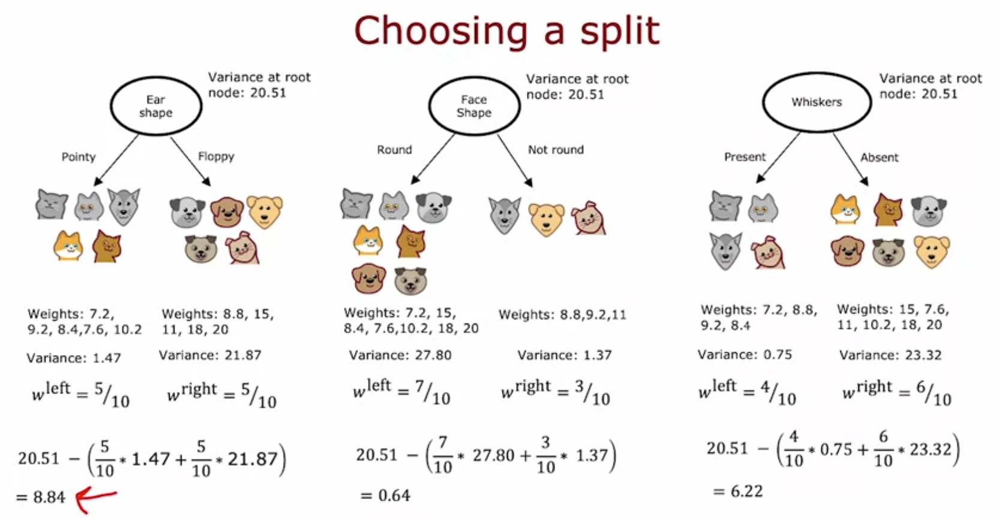

# Regression Trees

optional lecture but useful. so far trees only predicted categories (cat/not cat). this is about predicting a NUMBER instead. same features (ear shape, face shape, whiskers) but now weight is the thing we're predicting, not an input.

## what changes
classification tree: leaf predicts a class, decided by majority vote of training examples at that leaf.
regression tree: leaf predicts a number, decided by AVERAGING the training examples' target values that ended up at that leaf.

example from lecture: if 4 animals end up at a leaf with weights 7.2, 9.2, 8.4, 7.6, 10.2... wait that's 5 numbers actually (7.2, 9.2, 8.4, 7.6, 10.2), average = 8.35. so new test example landing at that same leaf just gets predicted as 8.35 lbs. that's literally it, no other magic.

so building the tree is still "ask questions, follow branches, land in a leaf" same as before. only the leaf's prediction method changed, from majority vote to average.

## the real question: how do you pick which feature to split on now?
before, we used entropy/information gain, because we cared about CLASS purity, how mixed cats/dogs were.

now we don't have classes anymore, we have numbers. so entropy doesn't even make sense here. what we actually care about is: are the numbers in each branch close together or spread out?

that's exactly what variance measures. variance = how spread out a set of numbers is. low variance = numbers clustered tight. high variance = numbers all over the place.

so the logic becomes: we want a split where each branch's numbers are as clustered/similar as possible. that's the regression equivalent of "purity."

## why variance instead of just eyeballing it
because we need one clean number to compare across different splits, same reason we needed entropy before. can't just "look" at 5 branches of numbers and decide which arrangement is best, need a formula.

low variance in a branch = model is confident, most animals in that branch weigh close to the same thing, so predicting their average is a good guess.
high variance = animals in that branch have wildly different weights, average is a bad guess, big potential error.

so minimizing variance after a split = making the tree's future predictions more accurate.

## how it's actually computed

step 1, variance at root: take ALL 10 weights (whole dataset before splitting), compute variance. this comes out to **20.51**. this is the "before" baseline, same role that H(0.5)=1 played for classification.

step 2, try each candidate feature, compute variance of each resulting branch:

**ear shape:**
left (5 animals): weights 7.2, 9.2, 8.4, 7.6, 10.2, variance = 1.47 (tight cluster, low)
right (5 animals): weights 8.8, 15, 11, 18, 20, variance = 21.87 (spread wide, high)

**face shape:**
left (7 animals): variance = 27.80 (very spread)
right (3 animals): variance = 1.37

**whiskers:**
left (4 animals): variance = 0.75
right (6 animals): variance = 23.32

step 3, weighted average variance (same weighting idea as before, weight by how many examples went each side):

ear shape: (5/10)(1.47) + (5/10)(21.87)
face shape: (7/10)(27.80) + (3/10)(1.37)
whiskers: (4/10)(0.75) + (6/10)(23.32)

step 4, reduction in variance (this is the actual metric used, mirrors information gain):

**reduction = variance at root - weighted avg variance after split**

ear shape: 20.51 - [(5/10)(1.47)+(5/10)(21.87)] = **8.84**
face shape: 20.51 - [(7/10)(27.80)+(3/10)(1.37)] = **0.64**
whiskers: 20.51 - [(4/10)(0.75)+(6/10)(23.32)] = **6.22**

ear shape wins by a lot. pick that feature to split root on.

## why this makes sense
biggest reduction in variance = the split that did the most to separate "light animals" from "heavy animals" into cleanly separated groups. that's exactly what we want, because then the average within each group becomes a genuinely useful, low error prediction.

if a split barely reduces variance (like face shape here, only 0.64), it means the two resulting groups are still just as mixed/spread as before, splitting there wouldn't actually help predictions much.

## after picking the split
exactly the same recursive process as classification trees. take the 5 examples on the left, treat as a fresh mini dataset, repeat the whole variance reduction calculation to pick the next split. same for right. keep going until stopping criteria hit (same criteria as before, min examples, max depth, etc, just judged on variance reduction now instead of info gain).

## what this means overall
classification trees use entropy -> information gain to pick splits.
regression trees use variance -> reduction in variance to pick splits.
conceptually identical process, just swapped the impurity measure to match what we're actually predicting (category vs number).

## next
apparently training a single tree isn't the end of the story, next topic is training MANY trees together (ensemble), gets much better results.

*Source: Andrew Ng, Machine Learning Specialization*
