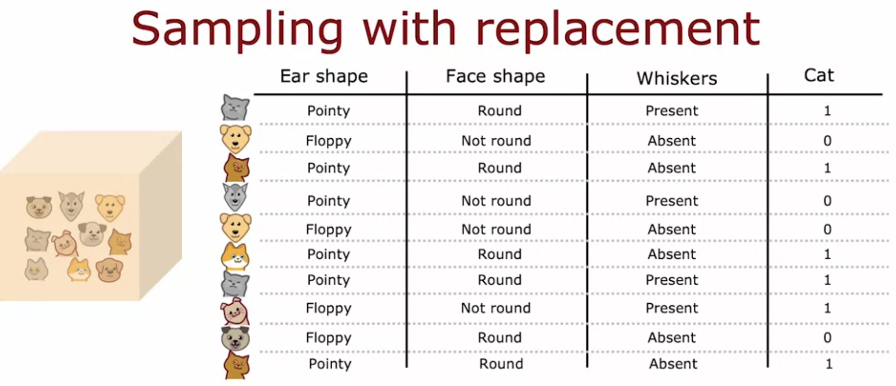

# Sampling with Replacement

## What it is
Sampling with replacement means picking an item at random from a set, then putting it back before picking again, so the same item can be picked more than once.

- Demo with 4 tokens (red, yellow, green, blue): pick one, replace it, shake, pick again
- Example sequence from lecture: green, yellow, blue, blue, so blue got picked twice and red not at all
- If you did not replace the token each time, you would always end up with the same 4 tokens back, so replacement is what makes each draw random and independent

## How it applies to building trees
The same idea is used to build a new training set out of the original one.

- Take the original 10 training examples, put them in a theoretical bag
- Pick one example at random, note it down, put it back in the bag
- Repeat this 10 times to build a new training set of the same size, 10 examples
- This new set will likely include some repeated examples and miss out on some original ones entirely, and that is expected, it is part of the procedure

## Why it matters
This is how we get multiple different training sets out of a single original dataset, which is exactly what we needed to build a tree ensemble.

- Each new sampled set is similar to the original but not identical
- Training a decision tree on each of these slightly different sets gives us different trees, which is the missing piece from the tree ensemble idea
- Next step is using this to actually build the ensemble
