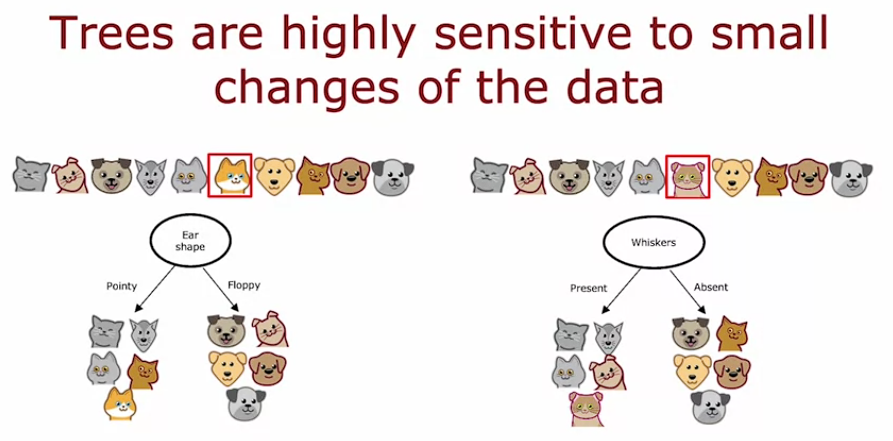
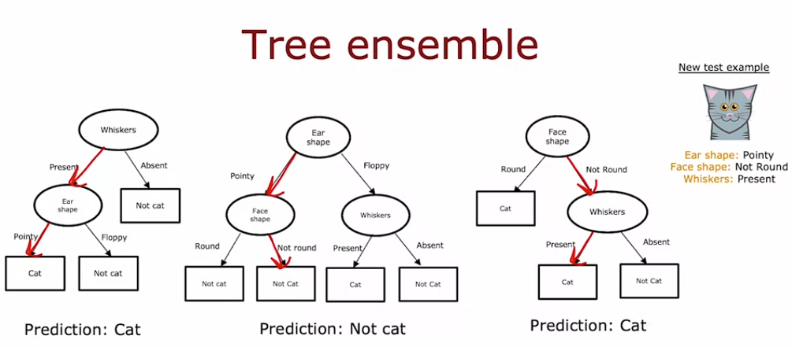

# Tree Ensembles

## Problem
Single decision tree is fragile. Changing just 1 training example out of 10 can flip the feature chosen at the root split, and since everything below is built recursively on that root, the whole tree ends up different. In the lecture example, changing one cat's features flipped the root split from ear shape to whiskers and gave completely different subtrees.

- Tree structure depends heavily on which exact examples were in the training set, not just the real pattern in the data

## Fix
Train a bunch of different decision trees instead of just one, called a tree ensemble. To predict, run the new example through all the trees and take a majority vote.

- Each tree gets only 1 vote, so no single tree controls the final answer
- Trees are trained on the same problem but end up structured a bit differently from each other, so their mistakes usually do not line up

## Example from lecture
3 trees, new example: pointy ears, not round face, whiskers present.

- Tree 1 predicts cat
- Tree 2 predicts not cat
- Tree 3 predicts cat

Majority vote is cat, so that is the final prediction, matches the correct answer here.

## Why it matters
This is the real reason ensembles beat single trees in practice. Even if one tree is off because of a quirk in the data it saw, the vote smooths it out, and predictions do not swing wildly if the training data changes slightly.

- This robustness is the whole motivation behind later methods like random forests and boosted trees

## Open question
How do we even get multiple different trees from the same dataset? Training the same algorithm on the same data 3 times would just give the same tree 3 times.

- Next topic answers this: sampling with replacement
