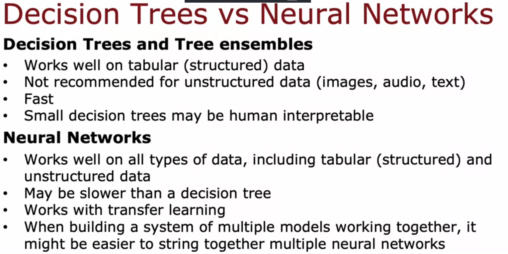
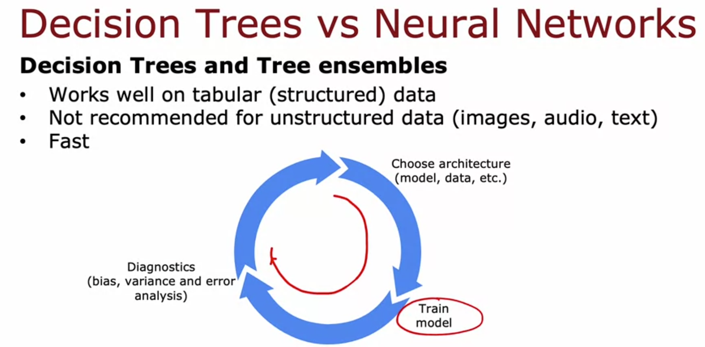

# Decision Trees vs Neural Networks

last video of the course. when do you actually pick one over the other?

## decision trees / tree ensembles

good for: tabular/structured data. basically if your data looks like a spreadsheet (rows = examples, columns = features like size, bedrooms, age etc), trees are worth it. works for both classification and regression on this kind of data.

bad for: unstructured data (images, audio, text). don't use trees here, NN does way better.

fast to train. this actually matters more than it sounds, because of the iterative loop (choose architecture, train, diagnose, repeat). if training takes forever, you can't loop quickly. trees being fast means faster iteration = faster improvement.

small trees can be human interpretable, you can literally print it out and see the logic. but Andrew says this gets overstated, once you have an ensemble of 100 trees each with hundreds of nodes, "interpretability" isn't really practical anymore, you'd need separate visualization tools anyway.

practical tip: if going with trees, just use XGBoost basically always. only reason to use a single tree instead of an ensemble is if compute budget is extremely tight (ensemble = more expensive than single tree).

## neural networks

works well on EVERYTHING, tabular data, unstructured data, and mixed. so on tabular data specifically, trees and NN are often competitive with each other, neither clearly wins. but for unstructured data (images/audio/text), NN is just the better choice, not really a contest.

downside: can be slower to train than trees, especially big ones.

benefit: works with transfer learning. huge deal when your dataset is small, since you can borrow a pretrained network and fine tune instead of training from scratch. trees can't really do this.

benefit: easier to chain multiple NNs together into a bigger system and train the whole thing jointly with gradient descent. trees can only be trained one at a time, no equivalent joint-training trick. (Andrew says the reason is technical, didn't need to fully get it for this course.)

## the actual decision
tabular data -> either works, trees (XGBoost specifically) often faster and just as good, worth trying first
unstructured data (images/audio/text) -> neural network, not really a choice
small dataset + unstructured -> NN + transfer learning, since trees can't leverage pretraining

## end of the course
that's it for decision trees and this whole "advanced learning algorithms" course. covered NNs and trees both now, plus a bunch of practical stuff (bias/variance, error analysis, the iterative loop, etc).

supervised learning needs labeled data (y). next course apparently covers unsupervised learning, algorithms that find patterns without labels at all.

*Source: Andrew Ng, Machine Learning Specialization*
