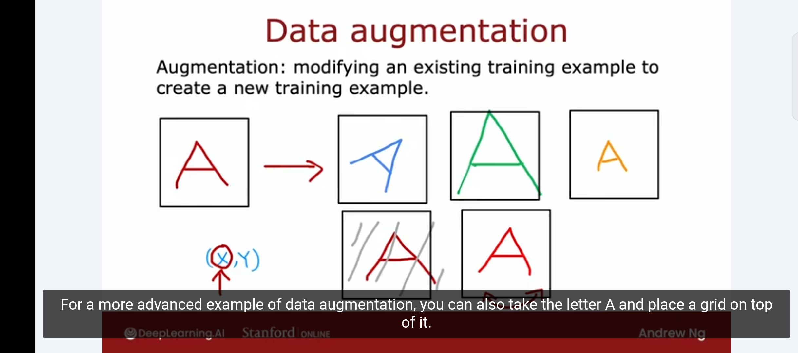
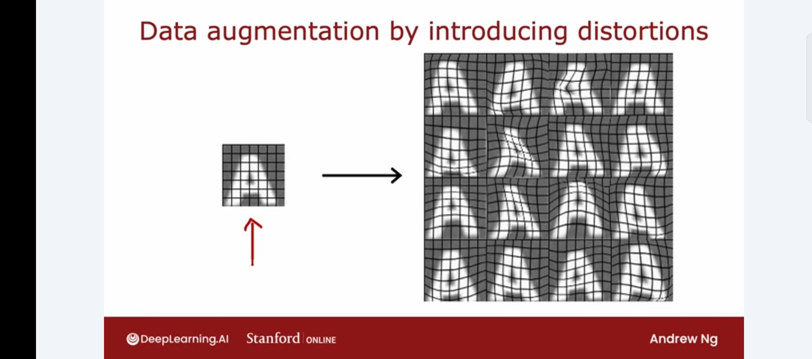
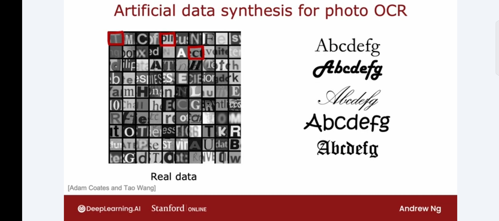
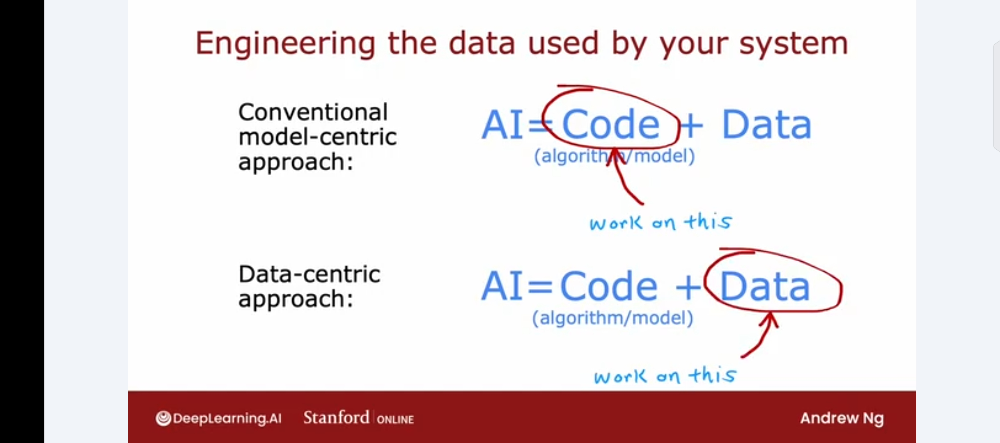

# Adding Data: Augmentation, Synthesis, and Data-Centric AI

Week notes from Andrew Ng ML Specialization. This lecture is about how to get more data efficiently, rather than just "collect everything."

## Do Not Just Collect More of Everything

The instinct when performance is bad is to go collect more data. That is fine if it is cheap. But blindly collecting more data of all types is slow and expensive, and may not even help if error analysis already told you where the problem is.

The smarter move: let error analysis tell you *what kind* of data to get. If pharma spam was causing 21 out of 100 errors, go find more examples of pharma spam specifically. Ask labelers to skim through unlabeled data and pull out pharma-related emails. That targeted effort will boost performance much more than adding thousands of random emails.

## Data Augmentation

Augmentation means taking an existing training example and modifying it to create a new one. The label stays the same. You are not inventing new information, just showing the algorithm more versions of what it already knows.

**For images (OCR example):** Take the letter A. Rotate it, enlarge it, shrink it, change the contrast, mirror it. Every one of these is still the letter A. You tell the algorithm: "A rotated 15 degrees is still an A." This makes the model more robust to variations it will encounter in the real world.

A more aggressive version: place a grid over the letter and apply random warpings. One image turns into dozens of warped versions, all still valid training examples for the letter A.

**For audio (speech recognition example):** Take a clean audio clip. Add crowd background noise. Add car engine noise. Simulate a bad cell phone connection. One original clip becomes three different training examples. Andrew said this was a critical technique in the speech recognition systems he worked on.

**The key rule for augmentation:** the distortions you introduce should be representative of what the model will actually see at test time. Adding crowd noise makes sense if real users will be speaking in noisy environments. Adding random per-pixel noise to images does not make sense because that is not what real-world degraded images look like. Augmentation is only useful if the augmented examples resemble what you expect in the test set.

## Data Synthesis

Synthesis is different from augmentation. Instead of modifying existing examples, you generate brand new ones from scratch.

The photo OCR example: the task is reading text from images taken in the real world, like signs or storefronts. Real training data means actual photos of letters, which are hard to collect at scale.

The synthetic alternative: open a text editor, pick random fonts, type random characters, screenshot them with different colors and contrast settings. You get images that look almost identical to real photo OCR data. One afternoon of code writing can produce a virtually unlimited training set.

This has been used heavily in computer vision. Less so for audio and other domains, but the principle is the same wherever you can realistically simulate what the model will see.

## Model-Centric vs Data-Centric AI

An ML system is: Code (the model/algorithm) + Data. For decades, most research worked by holding the data fixed and improving the code. Download a benchmark dataset, try to beat the state of the art on it.

That paradigm produced very good algorithms. Linear regression, logistic regression, neural networks, decision trees are all mature and work well.

The alternative, which has become more practically valuable, is to hold the code roughly fixed and instead focus on improving the data. This is the data-centric approach.

Data-centric means: collect more targeted data, clean the data better, use augmentation, use synthesis, engineer better features. The model might be a standard neural network that you barely touch. The work goes into making the data better.

Andrew's argument is that since the algorithms we have are already quite good, the bottleneck for many applications is now the data, not the model. Improving the data can often give you more performance gain per unit of effort than spending the same time on model architecture.

Neither approach is universally better. But it is worth asking at the start of a project: is the bottleneck the model or the data? The answer changes what you should work on.
