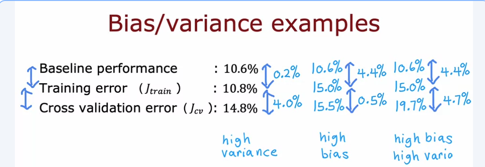

# Establishing a bsaeline level of performance 
This lecture introduces some concrete numbers for ​what J-train and JCV might be, ​and see how we can judge if ​a learning algorithm has high bias or high variance.

# Diagnosing Bias vs Variance: Baseline Performance

Week notes from Andrew Ng ML Specialization. Previous lectures explained what bias and variance are. This one answers: how do you actually look at J_train and J_cv numbers and decide which problem you have?

## The Problem With Just Looking at J_train

The naive approach is: if J_train is high, you have high bias. If J_cv is much higher than J_train, you have high variance. That works sometimes, but it falls apart in a lot of real applications.

Example from the lecture: a speech recognition system trained on noisy web search audio (things like "coffee shops near me" said into a phone in a noisy environment).

- J_train = 10.8%
- J_cv = 14.8%

At first glance, 10.8% training error looks terrible. You might conclude high bias immediately. But wait.

What if even a human expert can only transcribe this audio with 10.6% error? The audio is just that noisy. Some clips are genuinely incomprehensible.

Suddenly 10.8% training error looks completely fine. The algorithm is doing almost as well as a human. The actual problem here is the 4% gap between J_train and J_cv, which signals high variance, not high bias.

The raw number for J_train is meaningless without something to compare it against.

## Baseline Performance

The fix is to establish a baseline: what is the lowest error level you can realistically ever hope to reach?

Three ways to set this:

**Human level performance.** For unstructured data like audio, images, and text, humans are genuinely very good. If humans get 10.6% error on noisy audio, that is your floor. You cannot reasonably expect an algorithm to blow past human-level error on genuinely hard, noisy data.

**Prior or competing implementation.** If there's an existing system doing this task, its performance gives you a practical baseline.

**Domain knowledge or prior experience.** Sometimes you can estimate from context what a reasonable target is.

## The Two Gaps That Actually Matter

Once you have a baseline, you look at two gaps, not one:

**Gap 1: Baseline to J_train**

This tells you whether the model is doing well on the data it trained on, relative to what is even achievable.

If this gap is large, the model is not even fitting training data well. That is high bias.

**Gap 2: J_train to J_cv**

This tells you how much worse the model performs on unseen data compared to training data.

If this gap is large, the model does not generalize. That is high variance.

## Working Through the Three Cases From the Lecture

**Case 1: High variance**
- Baseline: 10.6%, J_train: 10.8%, J_cv: 14.8%
- Gap 1 (baseline to J_train): 0.2% → tiny, training is going well
- Gap 2 (J_train to J_cv): 4.0% → large, generalization is bad
- Verdict: high variance

**Case 2: High bias**
- Baseline: 10.6%, J_train: 15.0%, J_cv: 15.5%
- Gap 1 (baseline to J_train): 4.4% → large, not even fitting training data
- Gap 2 (J_train to J_cv): 0.5% → small, what it learns does generalize
- Verdict: high bias

**Case 3: High bias and high variance**
- Baseline: 10.6%, J_train: 15.0%, J_cv: 19.7%
- Gap 1 (baseline to J_train): 4.4% → large, underfitting
- Gap 2 (J_train to J_cv): 4.7% → large, not generalizing either
- Verdict: both problems at once

This last case is the worst situation and Andrew says it doesn't happen often in practice, but it is possible.
## Why Baseline Changes Everything

Without baseline, you would have looked at 10.8% J_train in case 1 and called it high bias. With baseline, you see it's actually almost at human level and the real issue is variance. The diagnosis flips completely.

For tasks where perfect performance is achievable (like predicting a deterministic function), baseline can be 0% and J_train just is what it is. But for tasks with inherent noise, like speech in bad conditions, medical imaging with ambiguous scans, or any domain where even experts make mistakes, baseline is nonzero and you cannot ignore it.

This is also why J_train not being close to zero is not automatically bad. It depends entirely on whether zero is even a realistic target.

## The Framework in One Sentence

Compare J_train to baseline to detect bias. Compare J_cv to J_train to detect variance. Both gaps need to be small for the algorithm to actually be working well.

