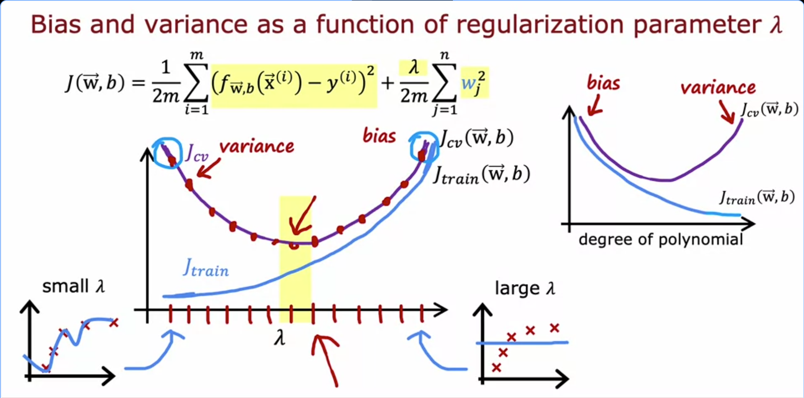

# Bias, Variance, and the Regularization Parameter λ

Week notes from Andrew Ng ML Specialization. Previous lecture covered how polynomial degree affects bias/variance. This one covers how λ does the same thing, and how to pick a good λ using cross-validation.

## Quick Recap: What λ Actually Does

The cost function we minimize is:

$$J(\vec{w},b) = \frac{1}{2m}\sum_{i=1}^{m}(f_{\vec{w},b}(\vec{x}^{(i)}) - y^{(i)})^2 + \frac{\lambda}{2m}\sum_{j=1}^{n}w_j^2$$

The left term is the fit to training data. The right term penalizes large weights. λ controls how much you care about each side.

Large λ → heavily penalize large weights → model is forced simple → might underfit.
Small λ → barely penalize weights → model can grow complex → might overfit.

The sweet spot is somewhere in between.

## The Two Extremes

**λ very large (e.g. 10,000):**

The algorithm is so motivated to keep weights small that it basically sets w1, w2, ... all close to zero. The model collapses to f(x) ≈ b, just a flat horizontal line, a constant. This clearly does not fit the training data at all. J_train is large, J_cv is large. This is high bias / underfitting.

**λ = 0 (no regularization):**

No penalty on weights at all. A high-degree polynomial is free to wiggle through every training point. J_train becomes tiny, J_cv becomes large. The model memorized the training set but fails to generalize. This is high variance / overfitting.

**Intermediate λ:**

Some middle value where the model is neither forced flat nor allowed to go wild. J_train and J_cv are both reasonably small. This is what you want.

## How J_train and J_cv Behave as λ Increases

This is the main graph from the lecture and it's worth understanding each curve separately.

**J_train goes up as λ increases.**

Larger λ means more weight given to the regularization term, less attention paid to actually fitting the training data. The model is literally being told "don't care as much about getting training examples right." So as λ grows, J_train climbs.

**J_cv forms a U-shape.**

On the left (small λ), J_cv is high because the model overfits. On the right (large λ), J_cv is high again because the model underfits. Somewhere in the middle, J_cv reaches its lowest point. That's the λ you want.

Notice this is a mirror image of the polynomial degree graph from last lecture. With degree d: left side was underfit (low d), right side was overfit (high d). With λ: left side is overfit (small λ), right side is underfit (large λ). Same U-shaped J_cv curve, just flipped horizontally.

## Using Cross-Validation to Choose λ

The procedure is exactly the same logic as choosing polynomial degree. Try a range of λ values, evaluate each on the CV set, pick the one with the lowest J_cv, then report performance on the test set once at the end.

A typical search might look like: λ = 0, 0.01, 0.02, 0.04, 0.08, ... doubling each time until around λ = 10. That gives you roughly 12 candidate values to try.

For each λ:
1. Minimize J(w,b) using that λ to get parameters w_k, b_k
2. Compute J_cv(w_k, b_k) with no regularization term (just raw CV error)
3. Keep track of which λ gave the lowest J_cv

Say λ = 0.08 (the 5th candidate, so w5, b5) gives the lowest J_cv. You pick that λ, use those parameters, and report J_test(w5, b5) as your final generalization error estimate.

The test set was never used in the λ selection process, so the estimate is fair.

## The Pattern Across All Model Selection

There is a consistent pattern now across everything covered so far:

When something is too small (degree d too low, or λ too large): **high bias, underfitting**, both J_train and J_cv are high.

When something is too large (degree d too high, or λ too small): **high variance, overfitting**, J_train is low but J_cv is much higher.

Cross-validation catches both. You try a range, evaluate J_cv, and pick the middle ground where J_cv is minimized. That applies whether you are selecting polynomial degree, regularization parameter, neural network architecture, or anything else.

## What's Coming Next

The lecture ended by flagging one thing still missing: what does "high" J_train or "much higher" J_cv actually mean in practice? We have relative comparisons but no absolute reference. Next lecture introduces the idea of a baseline performance level to make these judgments concrete.

