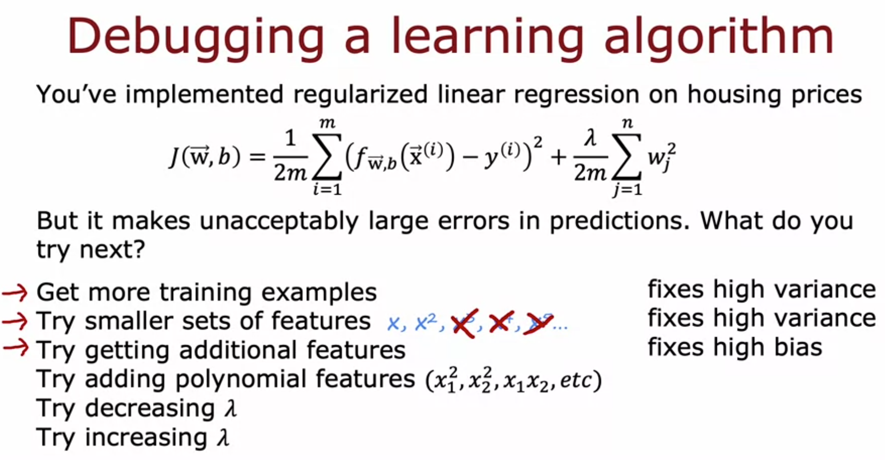

# Debugging a Learning Algorithm

Week notes from Andrew Ng ML Specialization. This is where bias/variance diagnosis actually becomes useful. The whole point of identifying whether you have high bias or high variance is that it tells you exactly what to try next, instead of guessing.

## The Problem Without This Framework

You trained regularized linear regression on housing prices. It makes unacceptably large errors. What do you do?

Without a framework, you'd probably just try things randomly. Get more data. Add features. Tune lambda. Maybe spend weeks collecting data only to find out that wasn't the problem at all.

With bias/variance diagnosis, each of those six options maps directly to one specific problem. You don't try them blindly. You first figure out whether you have high bias or high variance, then pick the fix that actually addresses that.

## The Six Options and What They Actually Fix

**Get more training examples → fixes high variance**

If the model is overfitting, it has essentially memorized a small training set. More data gives it more examples to generalize from and the overfitting gets diluted. But if the problem is high bias, getting more data doesn't help at all. A model that can't even fit simple training examples well won't suddenly get better just because there are more of them.

**Try smaller set of features → fixes high variance**

Too many features gives the model too many ways to fit complex, wiggly patterns that don't generalize. Dropping irrelevant or redundant features reduces the model's flexibility and forces it toward something simpler. This is how you reduce variance.

**Try getting additional features → fixes high bias**

If the model is underfitting, it's often because the input doesn't contain enough information to make good predictions. Predicting house price from size alone when price also strongly depends on number of bedrooms, number of floors, and age means the model literally cannot do well no matter how well it trains. Adding the missing information lets it actually learn the right relationship.

**Try adding polynomial features → fixes high bias**

Same logic as adding features. If a straight line cannot fit the pattern in the data, adding x², x1*x2, etc. gives the model the expressiveness it needs to fit the training set better. Fixing poor training performance is fixing high bias.

**Try decreasing λ → fixes high bias**

Large λ forces weights toward zero and makes the model simple. If the model is already underfitting, you want to give it more freedom, not less. Decreasing λ loosens the regularization constraint and lets the model pay more attention to fitting the training data.

**Try increasing λ → fixes high variance**

The opposite. If the model is overfitting, it's fitting the training data too aggressively. Increasing λ penalizes large weights more heavily, which forces the model toward a smoother, less wiggly function. Less flexibility means less variance.

## The Clean Summary

High variance: model is too complex, memorizing training data.
Fixes: more data, fewer features, increase λ.

High bias: model is too simple, can't even fit training data.
Fixes: more features, polynomial features, decrease λ.

One thing Andrew explicitly flagged that's easy to get wrong: do not try to fix high bias by reducing training set size. Yes, a smaller training set is easier to fit perfectly and J_train will drop. But J_cv gets worse, not better. You are not solving the problem, you are just making the training set easier to memorize. Do not do this.

## Why This Matters More Than It Seems

Andrew mentioned one of his ex-PhD students said bias and variance takes a short time to learn but a lifetime to master. That's probably true. The concepts are simple. Applying them correctly in a real project where the problem is messy and the signals are noisy is harder.

But even at this level, the framework already removes the biggest mistake people make, which is spending time on the wrong fix. Weeks of data collection for a high bias problem. Aggressive feature engineering for a high variance problem. Both are wasted effort because they don't address the actual issue. Diagnosis first, then fix.

