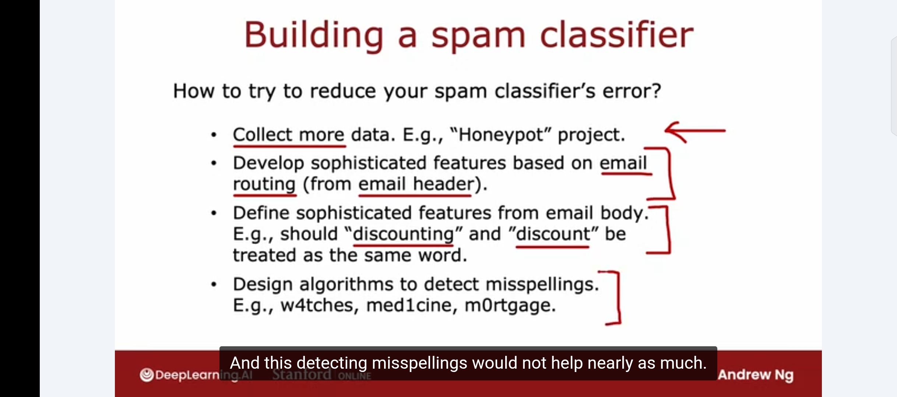
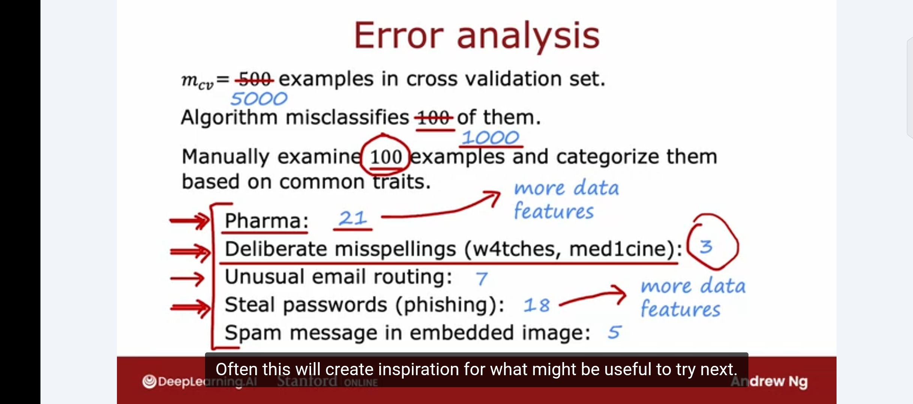

# Error Analysis

Week notes from Andrew Ng ML Specialization. Bias/variance is the most important diagnostic. Error analysis is second. Together they cover most of what you need to decide what to do next.

## What Error Analysis Is

After training a model, you check J_cv and find it misclassifies some examples. Error analysis is the process of manually looking through those misclassified examples and grouping them by what went wrong.

That's it. It's not a fancy algorithm. It's you reading through failures and counting patterns.

## The Spam Classifier Example

Say you have 500 CV examples and the model gets 100 wrong. You go through all 100 manually and tag each one with whatever category of error it represents. The counts from the lecture:

- Pharmaceutical spam: 21
- Phishing / password stealing: 18
- Unusual email routing: 7
- Spam message in embedded image: 5
- Deliberate misspellings (w4tches, med1cine): 3

Categories can overlap. A pharmaceutical spam email can also have unusual routing. One email counts in multiple categories if it applies.

If you have 1000+ errors and cannot read them all, sample around 100 randomly. That is usually enough to see which categories dominate.

## What the Counts Tell You

The counts directly tell you where improving would have the biggest impact.

Pharma spam (21) and phishing (18) are the big problems. Even a perfect fix for deliberate misspellings only fixes 3 out of 100 errors. The ceiling on that improvement is tiny.

Andrew mentioned he personally spent a lot of time building misspelling detectors for spam, only to realize later the actual impact was small. This is exactly the mistake error analysis prevents. If he had done the count first, he would have seen that 3/100 errors came from misspellings and deprioritized it immediately.

## What to Do With the Insights

Once you know where errors concentrate, it tells you what to try:

**Pharma spam is big.** You could collect more pharma-specific training data, or add features based on drug names and pharmaceutical product names that appear in spam.

**Phishing is big.** You could write code to extract URLs from emails and add features that detect suspicious links, or collect more phishing email examples specifically.

**Misspellings are small.** You can work on it eventually, but do not prioritize it over the bigger problems.

The key idea: instead of collecting "more data" in general, error analysis tells you *what kind* of data to collect. More pharma spam specifically, not just more email data in general. Targeted data collection is far more efficient than undirected data collection.

## The Limitation

Error analysis works well when you can read an example and understand why it is hard. Emails are readable. You can look at one and say "this is pharma spam, here is why the algorithm probably got it wrong."

It gets harder when the task is something humans cannot do well either. If you are predicting what ad someone will click on, you cannot look at a misclassified example and intuit why it was hard. The signal is not there. Error analysis is less useful in those cases.

## How This Connects to the Iterative Loop

Bias/variance tells you whether to get more data or change the model. Error analysis tells you *which* data and *which* features to focus on. They answer different questions and you use both.

Bias/variance: should I invest in more data at all?
Error analysis: if yes, what kind, and what features would help most?

Between these two diagnostics you can make most of the important decisions in the iterative loop without guessing.

