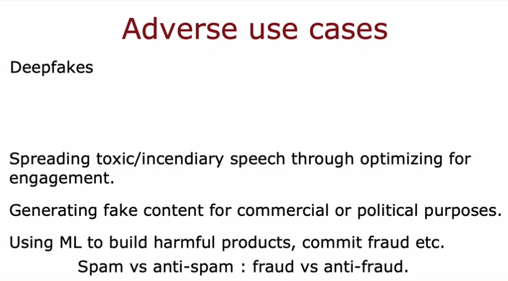
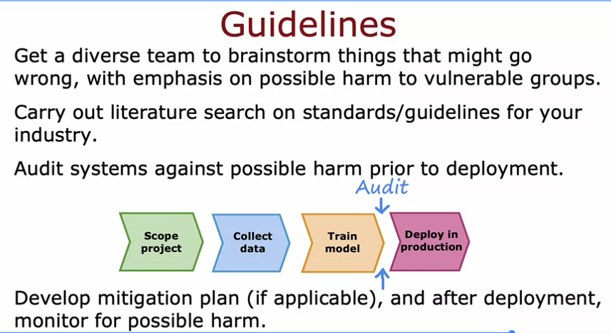

# Fairness, Bias, and Ethics in ML

Main point: ML systems affect billions of people now, so if I'm building something that touches people's lives I actually need to think about fairness, bias and ethics. Can't just treat it as an afterthought.

## Real examples of things going wrong

- A hiring tool that discriminated against women (company stopped using it, but the point is it should never have been rolled out in the first place)
- Face recognition matching dark skinned individuals to criminal mugshots way more often than lighter skinned individuals
- Biased bank loan approval systems that discriminated against certain subgroups
- Reinforcing negative stereotypes, like his example of his own daughter searching a profession online and not seeing anyone who looks like her, which could discourage her from ever considering that career

What this is: cases where the model treats people differently, and worse, based on group membership like gender or skin tone. Usually happens because of biased training data or a badly thought out objective.

Why it matters: this isn't just a normal bug, it causes real harm to real people, and a lot of the time it hits groups that are already vulnerable. Unlike a random wrong prediction, biased errors are systematic, they keep hitting the same group over and over.

## Adverse use cases (people misusing ML on purpose)

- Deepfakes, example given was BuzzFeed's Obama deepfake video, which was fine because they did it with full transparency and disclosure. Making fake videos without consent or disclosure is unethical though.
- Spreading toxic or incendiary speech, happens when platforms optimize purely for engagement since outrage drives engagement
- Generating fake content for commercial or political purposes, like bots posting fake reviews or fake political comments
- Using ML to build harmful products or commit fraud, there's an ongoing arms race between spam and anti spam, fraud and anti fraud

What this is: different from the bias problem above. Here the model itself isn't necessarily unfair, it's that people are using ML on purpose to cause harm.

Why it matters: ML is a powerful tool and like any powerful tool people can point it at bad goals. His stance was pretty clear, if you're ever asked to work on something you personally think is unethical, walk away, even if it makes financial sense. He said he's killed projects on ethical grounds himself even when they would've made money.

## Guidelines for making systems fairer and more ethical

He was honest that there's no universal checklist for this. He said he even read philosophy and ethics books hoping to find a simple 5 step answer and never found one. But here's the practical guidance he gave, and it maps onto the same project cycle from the last video:

1. Get a diverse team to brainstorm what could go wrong, with extra focus on possible harm to vulnerable groups. Diversity here means gender, ethnicity, culture, all of it. More diverse teams are just better at spotting blind spots.
2. Do a literature search on standards or guidelines for your specific industry, example given was fairness standards starting to show up in finance for loan approval systems
3. Audit the system against the harms you identified. This happens after training but before deployment, in the diagram the audit step sits right between train model and deploy in production
4. Have a mitigation plan ready if something goes wrong, like being able to roll back to the last known fair version, and keep monitoring for harm even after deployment so you can react fast. His example was self driving car teams already having an accident response plan ready before any accident happens, instead of scrambling to figure it out after the fact

How it connects to the cycle: this isn't some separate process, it's layered on top of the same scope, collect, train, deploy loop, just with an audit checkpoint added before deployment and ongoing monitoring after deployment.

Why it matters: catching a fairness or harm problem before deployment is so much cheaper (in terms of human cost) than catching it after. Also the level of care should match the stakes, he gave the example that a model deciding how long to roast coffee beans has basically zero ethical stakes, but a loan approval model can seriously hurt people if it's biased.
