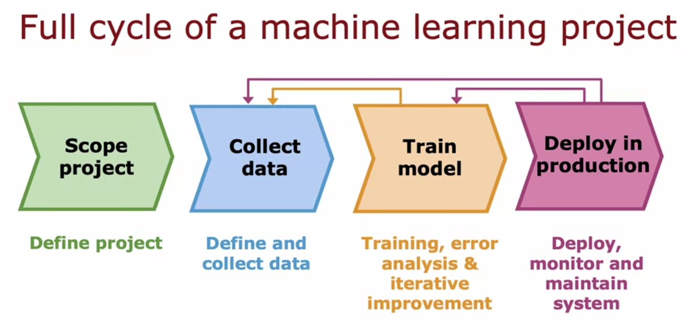
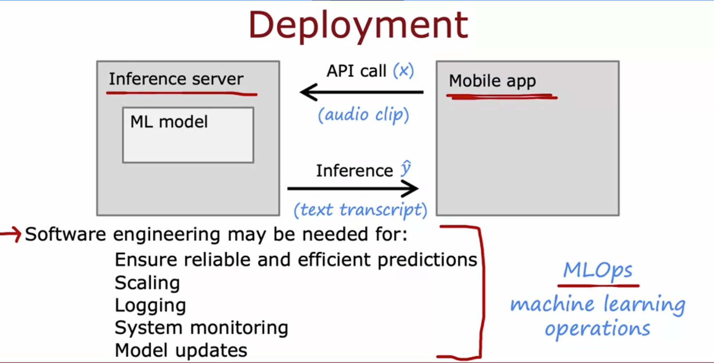

# Full Cycle of an ML Project + Deployment

Main point from lecture: training the model is only one part of building a real ML system. There's a whole cycle around it. He used speech recognition (voice search on your phone) as the example throughout.

## The 4 stages

1. Scope project = decide what you're even working on (his example: speech recognition for voice search)
2. Collect data = get audio + transcripts, basically the labels
3. Train model = train it, do error analysis, keep improving
4. Deploy in production = ship it, then monitor + maintain it

Important thing to note: this is not a straight line, it's a loop. Look at the arrows in the diagram, they go backward too, from train back to collect data, and from deploy all the way back to train/collect. So you don't just do these 4 steps once and forget about it.

What it is: the whole process of building an ML product, scoping the project, getting data, training, deploying, and looping back whenever you need to.

How it works: you scope the project, gather data, train the model and do error analysis. If error analysis shows a weak spot (his example was the model doing badly with car noise in background), you go get more data for that specific weakness, in his case using data augmentation to make more car noise audio. Then once it's good enough you deploy. Even after deploying you're not done, if it's not performing well in the real world you go back and train more or collect more data again.

Why this matters: because a model that looks great on your dataset can still fail once real users use it (new slang, new celebrity names showing up, user behavior shifting over time). If you don't loop back and keep improving it, the system just quietly gets worse over time. Treating ML like a one time training run and then walking away is the mistake beginners make.

## Deployment in detail

Deployment usually looks like this:

- the trained model sits inside an inference server
- some client, like a mobile app, makes an API call sending input x (here it's the audio clip)
- inference server runs the model and sends back the prediction ŷ (here it's the text transcript)

What it is: deployment means taking your trained model and putting it behind an API so real apps can actually call it and get predictions back.

How it works: mobile app records audio, sends it through an API call to the inference server, inference server runs the model, sends back ŷ (the transcript), app shows it to the user. Around all of this you usually need software engineering for:
- reliable and efficient predictions (keeping latency/cost low)
- scaling to however many users you have
- logging inputs and predictions (only if privacy/consent allows this)
- system monitoring
- pushing model updates when needed

This whole practice has a name, MLOps (machine learning operations). It's the systematic way of building, deploying, and maintaining ML systems.

Why this matters: because the real world keeps shifting under your model. His own example, his speech system was trained on old data, then new politicians got elected or new celebrities got famous, and people started searching those names. The model had never seen those words so it did badly there. The only reason they caught it was because they were monitoring the system, that's what let them notice the shift, retrain, and push an update. Without monitoring the model would've just kept getting worse silently.

Also worth remembering, how much software engineering you need depends on scale. A laptop demo for a handful of people needs way less than a system serving hundreds of millions.
