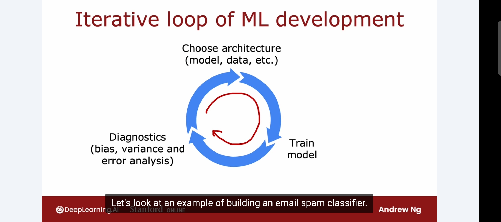

# The Iterative Loop of ML Development

Week notes from Andrew Ng ML Specialization. This lecture ties everything from the past few videos together into how ML development actually works in practice.

## The Loop

Building an ML system is never a straight line. It is a loop and you will go around it multiple times. The three stages:

**Choose architecture.** Pick the model type (logistic regression, neural network, etc.), decide what data to use, set initial hyperparameters. This is your starting guess. It will not be perfect.

**Train the model.** Implement and train on your training set. The first time you train, it will almost never work as well as you want. That is expected and normal.

**Run diagnostics.** This is where all the bias/variance and error analysis tools come in. You look at J_train, J_cv, compare to baseline, identify whether you have high bias or high variance, and figure out what is actually going wrong.

Then you use those insights to make a specific informed change to the architecture, data, or hyperparameters, and go around the loop again. You keep doing this until performance is acceptable.

The critical word is *informed*. You are not randomly trying things. Each iteration is driven by what the diagnostics told you.

## Why the Diagnostic Step Matters So Much

The lecture used a spam classifier to make this concrete. Say you build an initial classifier and it does not perform well. You immediately have a list of possible things to try:

- Collect more data (build a honeypot project to attract spam)
- Add email routing features (the path an email takes through servers can reveal if it came from a spammer)
- Improve text features (treat "discount" and "discounting" as the same word, detect deliberate misspellings like "w4tches" or "m3dicine")

All of these sound reasonable. But they vary wildly in how much effort they take. A honeypot project to collect spam at scale could take months. Spending months on something that will not help is a serious problem.

Here is where the loop pays off. If you check your diagnostics first:

- High bias? Collecting more data will not help. The model cannot even fit what it already has. Work on better features instead.
- High variance? More data could help a lot. A honeypot project might actually be worth the investment.

Choosing the right direction easily makes your project ten times faster. That is Andrew's number from the lecture and it feels right. Wasted effort on the wrong direction is the single biggest time sink in ML projects.

## The Spam Classifier Feature Construction

Worth noting for reference since it came up: one standard way to featurize an email is to take the top 10,000 words in the English language and create a binary feature vector where each entry is 1 if that word appears in the email, 0 if it does not. So x1 through x10000, each being a word presence indicator. You can also use word counts instead of binary, though binary works reasonably well.

This turns a text email into a fixed-length numeric vector that a logistic regression or neural network can work with.

## What Comes Next

This loop has two main diagnostic tools. Bias/variance analysis is one, which is what the past several lectures covered. Error analysis is the second, which is what the next lecture introduces. Together they give you enough signal to make good decisions about where to spend your time.

The loop itself never really ends during development. Even after you ship, you collect new data, find new failure modes, and go around again.

