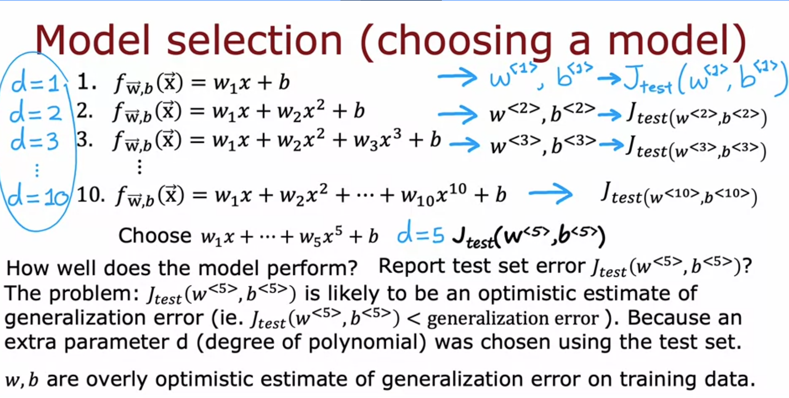

# Model Selection and Cross-Validation

The key problem: how do you *choose* which model to use without cheating yourself?

## What Generalization Error Actually Means

Every model is trained on a finite dataset. Generalization error is the answer to: **how would this model perform on data it has never seen at all?**

You can never measure this exactly. "All future data" is infinite and unknowable. What you can do is approximate it using a held-out portion of your data that the model never trained on. J_test is your estimate of generalization error. It is always an approximation. The question is whether it's a *fair* approximation or a biased one.

## The Problem With Using Test Set for Model Selection

Say you want to pick the right polynomial degree for a housing price regression. You try d=1 through d=10. The naive approach:

Train each model on the training set, evaluate all 10 on the test set, pick whichever gets the lowest J_test. Say d=5 wins. Now report J_test(w5, b5) as your model's performance estimate.

This is the flawed procedure from the lecture. The problem is that **you used the test set to make a decision** (choosing d=5). The test set is no longer a neutral evaluator.

Think of it as taking a test 10 times and reporting your highest score as your "ability". That highest score is not representative of how you'd actually do on a new exam. You got lucky on that particular test, on that particular attempt.

J_test(w5, b5) is now an overly optimistic estimate. It is lower than your true generalization error. You picked d=5 precisely because it scored well on this test set, not because it genuinely generalizes best.

## What "Overly Optimistic" Means

Overly optimistic just means the error number you're reporting is too low. Your estimate of how bad the model is, is rosier than reality.

This happens in two ways:

**Fitting w and b on training data:** the model literally adjusted its weights to minimize error on training examples. Of course J_train looks good. It is always going to be lower than true generalization error because the model optimized for exactly that data.

**Choosing d using test data:** you ran 10 evaluations and reported the lowest score. That lowest score came from a combination of the model actually being good AND getting lucky on this particular test set. The "getting lucky" part will not repeat on new data. So you are reporting an error that is systematically lower than what you'd see in production.

## The Fix: Cross-Validation Set

Instead of splitting into 2 subsets (train/test), split into 3:

**Training set (~60%):** model trains here, w and b are fitted here, nothing else.

**Cross-validation set (~20%):** also called dev set, validation set, or just CV set. This is used exclusively for model selection decisions. No training happens here.

**Test set (~20%):** completely untouched until the very end. Only used once, to report the final generalization error estimate.

The CV error formula is the same structure as J_test, just computed over the CV examples:

$$J_{cv}(\vec{w},b) = \frac{1}{2m_{cv}} \sum_{i=1}^{m_{cv}} \left(f_{\vec{w},b}(\vec{x}^{(i)}_{cv}) - y^{(i)}_{cv}\right)^2$$

No regularization term in any of these: J_train, J_cv, J_test. Just raw average error.

## The Correct Model Selection Procedure

Step 1: Train all candidate models (d=1 through d=10) on the training set. Get parameters w1/b1, w2/b2, ..., w10/b10.

Step 2: Evaluate each model on the **CV set**. Compute J_cv for all 10. Pick the one with the lowest J_cv. Say d=4 wins.

Step 3: Now report performance on the **test set**. Compute J_test(w4, b4). This is your final, honest estimate of generalization error.

Why is J_test now fair? Because d=4 was chosen using the CV set, not the test set. w4 and b4 were fitted using the training set, not the test set. The test set was never involved in any decision. No parameter, not w, not b, not d, was chosen by looking at it. So it gives an unbiased estimate of how the model will actually do on new data.

The CV set gets "used up" in selection, exactly like the training set gets used up in fitting. That's fine. The test set stays clean precisely because it was never touched.

## This Works for Neural Networks Too

You are not limited to polynomial degree. The same procedure works for choosing neural network architecture: how many layers, how many units per layer.

Train a small, medium, and large network on the training set. Evaluate all three on the CV set. Pick whichever has the lowest J_cv. Report that model's performance on the test set once at the end.

For classification, J_cv is typically the fraction of CV examples misclassified, same as what we saw for J_test last lecture.

## The Rule to Remember

Make ALL decisions (fitting parameters, choosing model complexity, choosing architecture) using only the training set and CV set.

Never look at the test set until you have your final model. Once you do look at it, that's it. You get one look. If you use J_test to make another decision, it becomes as contaminated as J_train and you need a new held-out set.

The whole point is that the test set only gives a fair estimate of generalization error if no decision was ever made using it.