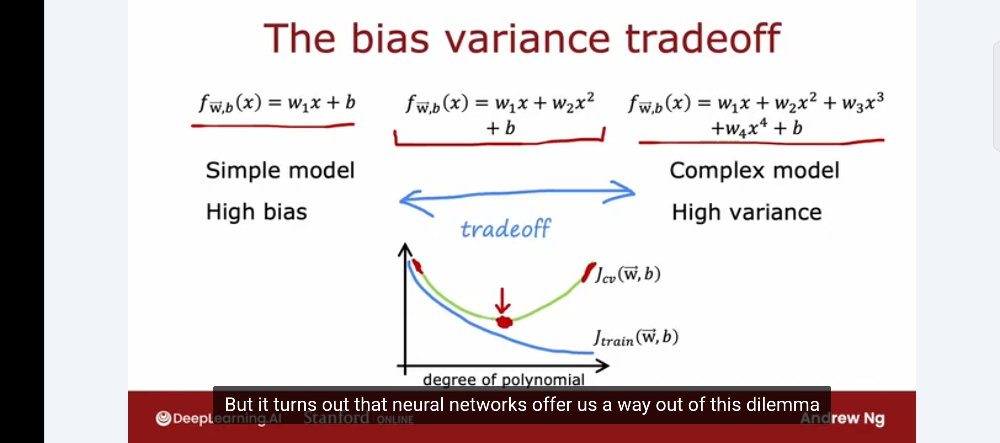
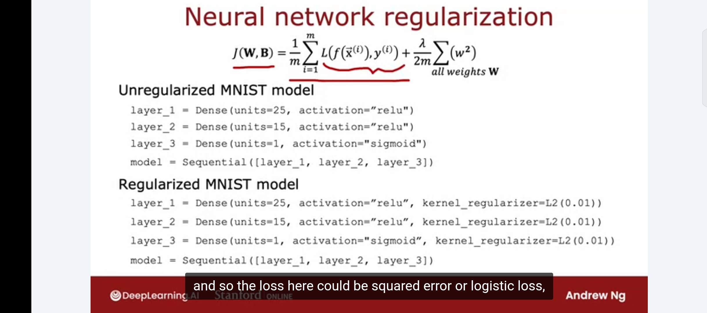

# Neural Networks and the Bias-Variance Tradeoff

Week notes from Andrew Ng ML Specialization. This is actually a big deal conceptually. Neural networks change how you think about bias and variance entirely.

## The Old Problem: Tradeoff

Before neural networks, the bias-variance tradeoff was a genuine constraint. You had one knob to turn: model complexity.


Make the model simpler (low degree polynomial) and you get high bias. Make it more complex (high degree polynomial) and you get high variance. The only option was to find a sweet spot in the middle where J_cv was minimized. You could not eliminate both problems simultaneously. Fixing one made the other worse.

That is what people mean when they say "bias-variance tradeoff." It was a real tradeoff.

## What Neural Networks Change

Large neural networks, when trained on small-to-moderate sized datasets, are essentially low-bias machines. If you make a neural network big enough, it can almost always fit the training set well.

This breaks the tradeoff. Instead of finding a compromise between two bad things, you now have a recipe that addresses them one at a time.

## The Recipe

**Step 1: Train on the training set. Check J_train.**

Is J_train high relative to your baseline? That is high bias. The fix is simple: use a bigger network. Add more hidden layers or more units per layer. Keep making it bigger until J_train is at an acceptable level. A large enough neural network can almost always bring training error down.

**Step 2: Check J_cv.**

Is the gap between J_cv and J_train large? That is high variance. The fix: get more data. Retrain, then go back to step 1.

You loop through this until both J_train and J_cv are at an acceptable level. At that point you are done.

The key insight is that these two fixes do not conflict. Getting more data helps variance without hurting bias. Making the network bigger helps bias. You are not sacrificing one to fix the other.

## What About Overfitting With a Big Network?

A natural question: if you make the network huge, won't it overfit badly?

The answer is that a large neural network with well-chosen regularization will usually do as well or better than a smaller one. A bigger network has more capacity to overfit, but regularization controls that. As long as regularization is set appropriately, going bigger almost never hurts performance. The only real cost is computational: larger networks take longer to train.

So the practical default is: when in doubt, go bigger and regularize.

## Regularization in Neural Networks


The regularization term works the same way as in linear and logistic regression. You add a penalty on the weights to the cost function:

$$J(\mathbf{W}, \mathbf{B}) = \frac{1}{m}\sum_{i=1}^{m} L(f(\vec{x}^{(i)}), y^{(i)}) + \frac{\lambda}{2m}\sum_{\text{all weights}} w^2$$

The sum runs over every weight in every layer of the network. As usual, biases b are not regularized (makes very little difference in practice either way).

In TensorFlow, you add it per layer with `kernel_regularizer=L2(0.01)`. You can use different lambda values per layer but in practice one value for all layers is fine.

```python
# Unregularized
layer_1 = Dense(units=25, activation="relu")

# Regularized
layer_1 = Dense(units=25, activation="relu", kernel_regularizer=L2(0.01))
```

The lambda value (0.01 here) is a hyperparameter you tune using the CV set, exactly like before.

## Why This Explains the Rise of Deep Learning

The recipe only works if two things are available: large neural networks and large datasets. Getting more data to fix variance requires data to actually exist. Training bigger networks requires compute (GPUs made this feasible).

When both became available, the recipe could actually run. Train a huge network, fix bias almost for free, get more data to fix variance, repeat. That loop is essentially what drove the deep learning wave of the last decade.

## The Practical Takeaway

When training neural networks today, Andrew says he spends most of his time fighting variance problems, not bias. Because if the network is large enough, bias is usually not the issue. High variance (needing more data, or better regularization) tends to be what remains.

Bias and variance diagnosis still matters, but the answer to "I have high bias" is now "make the network bigger" rather than "find a delicate middle ground in model complexity."

