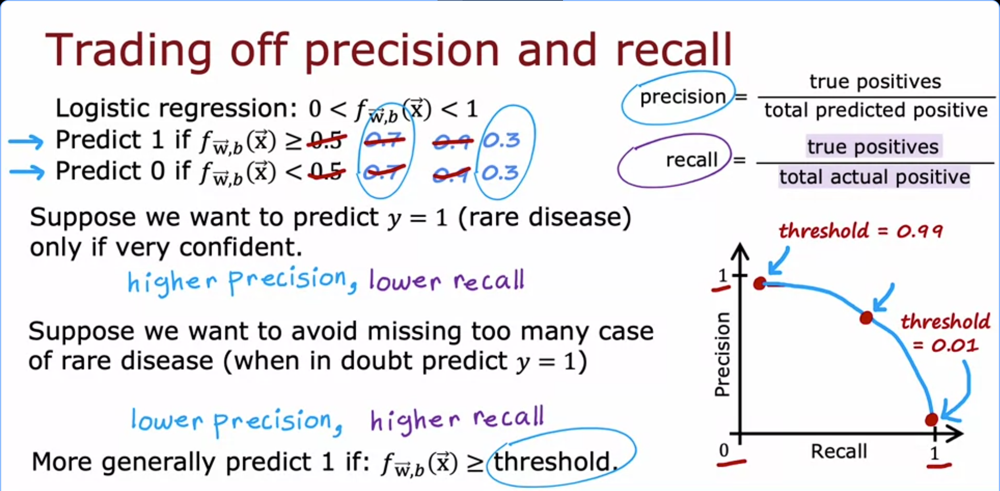
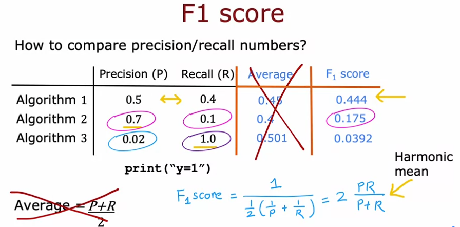

# Precision/recall tradeoff + F1 score

we want both precision and recall high, but usually a tradeoff between them. this is about how to actually pick a point.

## Threshold controls the tradeoff

logistic regression → f(x) between 0 and 1. normally predict 1 if f(x) >= 0.5. but that 0.5 is just a default, can move it.

- raise threshold (0.7, 0.9...) → only predict disease if very confident → precision up, recall down
  - makes sense when treatment is risky/invasive/expensive, don't want to scare someone into it unless sure
- lower threshold (0.3...) → predict yes even when unsure → precision down, recall up
  - makes sense when treatment is cheap/safe but missing the disease is really bad

so: higher threshold = more cautious = fewer false positives but more missed cases. lower threshold = opposite.

plotting precision vs recall across thresholds gives a curve, pick a point based on what's worse for your app, missing cases or false alarms. not something CV picks for you, it's a judgment call.

## Comparing algorithms is annoying with 2 numbers

If algo A wins on precision but algo B wins on recall, no obvious winner. need one number.

**don't average P and R** — example: an algo that just does print("y=1") always → P=0.02, R=1.0, avg = 0.501, looks decent but it's useless (predicts everyone positive).

## F1 score fixes this

F1 = 2PR / (P+R) → "harmonic mean," basically punishes whichever of P or R is lower instead of just averaging them out.

algo 2's F1 (0.175) sits way closer to 0.1 than 0.7, exactly what we want, a weak recall drags the score down hard.

**winner** here = algo 1, even though it doesn't have the best P or best R alone. just most balanced.

