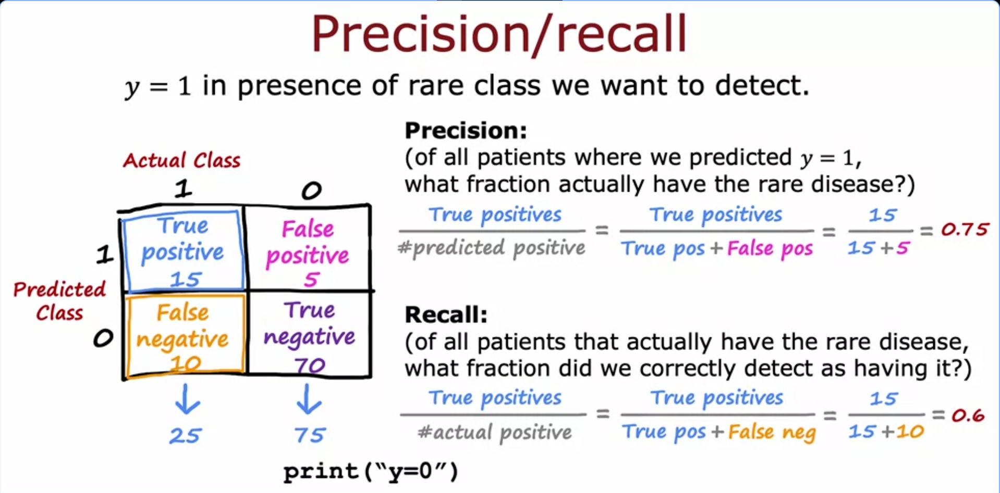

# Skewed Datasets, Precision and Recall

Started with a problem, when your positive and negative classes are really skewed (like way off from 50/50), normal accuracy stops being a useful metric.

## Why accuracy breaks down

Example from lecture, training a classifier to detect a rare disease. y = 1 means disease present, y = 0 means not present.

Say you get 1 percent error on the test set, that sounds amazing, 99 percent correct. But if the disease is actually rare, like only 0.5 percent of patients have it, then a dumb program that just does `print("y=0")` every single time would get 99.5 percent accuracy, which is better than your actual model.

That "algorithm" never predicts anyone has the disease and is still beating your real model on accuracy. So clearly accuracy alone can't tell you if your model is actually good or garbage. You can't compare two models just by comparing their error percentages either, the one with lower error might just be the one that never predicts positive.

## Confusion matrix

To actually evaluate a model on a rare class problem, you build a confusion matrix. Actual class goes on top (1 or 0), predicted class goes on the side (1 or 0). Then you count up examples into 4 cells:

- true positive = predicted 1, actual 1 (you got it right)
- false positive = predicted 1, actual 0 (you said yes but it was a no)
- false negative = predicted 0, actual 1 (you said no but it was actually a yes)
- true negative = predicted 0, actual 0 (you got it right)

In the lecture example out of 100 cross validation examples: 15 true positives, 5 false positives, 10 false negatives, 70 true negatives. That adds up to 25 actual positives and 75 actual negatives.

## Precision

What it is: of everything you predicted as positive, how much of it did you actually get right.

Formula: true positives / (true positives + false positives)

In the example: 15 / (15+5) = 15/20 = 0.75, so 75 percent precision. Means when the model says a patient has the disease, it's right 75 percent of the time.

## Recall

What it is: of everyone who actually has the disease, how many did the model actually catch.

Formula: true positives / (true positives + false negatives)

In the example: 15 / (15+10) = 15/25 = 0.6, so 60 percent recall. Means the model is catching 60 percent of all the real disease cases out there.

## Why this fixes the print("y=0") problem

If a model just predicts 0 every single time, it has zero true positives. That makes recall = 0/(0 + actual positives) = 0. So recall instantly exposes the "just guess negative" trick, precision would also break down (0/0, undefined, but basically treated as 0 too).

Why it matters: a good model on a skewed dataset needs to have both precision and recall reasonably high. High precision alone isn't enough (could just rarely predict positive but always be right when it does), and high recall alone isn't enough (could predict positive constantly and catch everyone but with tons of false alarms). Looking at both together is what actually tells you if the model is useful.

Next video is apparently about trading off precision vs recall.
