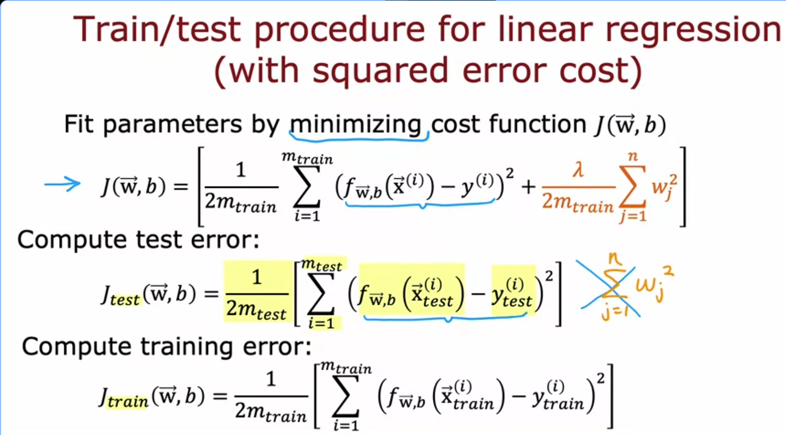
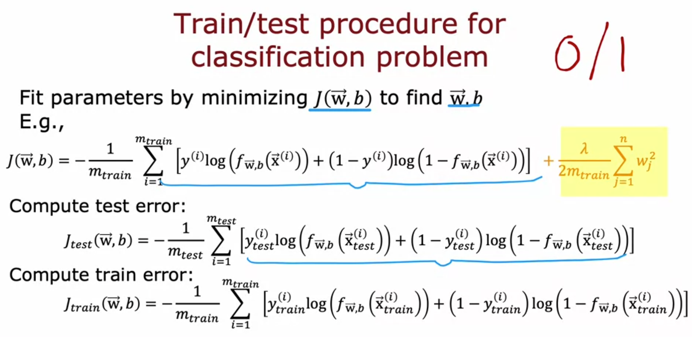

# Evaluating a Model: Train/Test Split

## Why You Can't Just Look at Training Error

The obvious way to check if a model is good is to see how well it fits the data you trained it on. But that's the problem — a model can fit training data perfectly and still be completely useless.

Classic example from the lecture: fit a 4th-order polynomial to 5 data points. It curves through every single point. Training error is essentially zero. But look at the curve and it's obviously overfitted — extremely wiggly, and it will give nonsense predictions for new inputs.

With one feature you can plot this and see it immediately. But what if you have 4 features? You can't plot a 4-dimensional function. You need a systematic way to catch this.

## The Fix: Split Your Data

Take your dataset and split it into two parts before you do anything:

**Training set (~70%):** this is what the model actually learns from. You minimize the cost function on this data to find w and b.

**Test set (~30%):** the model never sees this during training. You use it after training to check if the model generalizes.

The notation Andrew uses: m_train for the number of training examples, m_test for the number of test examples. In a dataset of 10 examples, you'd have roughly 7 training and 3 test.

Common splits are 70/30 or 80/20. Most data goes into training so the model has enough to learn from. The test set just needs to be big enough to give a reliable estimate of generalization error.

## For Linear Regression

**Training:** minimize the usual cost function J(w,b) which includes the squared error term plus the regularization term (lambda over 2m times sum of w_j squared).

**Test error** J_test(w,b): average squared error across test examples only. Critically, no regularization term here. You're measuring raw prediction error, not the regularized objective.

$$J_{test}(\vec{w},b) = \frac{1}{2m_{test}} \sum_{i=1}^{m_{test}} \left(f_{\vec{w},b}(\vec{x}^{(i)}_{test}) - y^{(i)}_{test}\right)^2$$

**Training error** J_train(w,b): same thing but computed on the training set. Also no regularization term. Just the average squared error on training examples.

If J_train is very low but J_test is high, that's the textbook overfit signal. The model memorized the training data but can't generalize.

## For Logistic Regression (Classification)

Same split idea. Train by minimizing J(w,b) which is the logistic loss plus regularization. Then compute J_test and J_train using the logistic loss (no regularization in either).

$$J_{test}(\vec{w},b) = -\frac{1}{m_{test}} \sum_{i=1}^{m_{test}} \left[y^{(i)}_{test} \log\left(f_{\vec{w},b}(\vec{x}^{(i)}_{test})\right) + (1-y^{(i)}_{test})\log\left(1-f_{\vec{w},b}(\vec{x}^{(i)}_{test})\right)\right]$$

This works fine. But Andrew mentioned a second way to compute test and training error for classification that is actually more commonly used in practice.

## The Part That Confused Me: Fraction of Misclassified Examples

Instead of computing the logistic loss on the test set, you can just directly count how many predictions were wrong.

Here is the exact thing Andrew described, broken down carefully.

**Step 1: Your model outputs a probability, not a label**

Logistic regression gives you f(x), which is a number between 0 and 1. It is the estimated probability that the label is 1. It is not a hard yes/no decision yet.

**Step 2: You apply a threshold to get a hard prediction**

$$\hat{y} = \begin{cases} 1 & \text{if } f_{\vec{w},b}(\vec{x}) \geq 0.5 \\ 0 & \text{if } f_{\vec{w},b}(\vec{x}) < 0.5 \end{cases}$$

So every test example now gets assigned either a 0 or a 1 as your model's hard prediction.

**Step 3: Compare the prediction to the actual label**

For each test example, you check: is y_hat equal to y? If yes, correct prediction. If no, wrong prediction.

**Step 4: Count the fraction that were wrong**

$$J_{test} = \frac{\text{number of misclassified test examples}}{m_{test}}$$

Same thing for training data:

$$J_{train} = \frac{\text{number of misclassified training examples}}{m_{train}}$$

**Concrete example to make this stick:**

Say you're classifying handwritten digits as 0 or 1. You have 100 test examples. Your model makes predictions. 8 of them are wrong (a 0 was classified as 1, or a 1 was classified as 0). Then:

$$J_{test} = \frac{8}{100} = 0.08$$

That means 8% error rate on the test set. Clean and interpretable.

**Why is this preferred over the logistic loss version?**

The logistic loss gives you a number like 0.34. What does that mean? It's not immediately obvious whether that's good or bad, and it's hard to explain to anyone outside of ML.

The misclassification fraction gives you "the model got 8% of test examples wrong." That's immediately understandable. It maps directly to the actual question you care about: how often does this model make mistakes?

Both measure the same underlying thing (how well the model generalizes) but the fraction version is more human-readable and more commonly reported in practice.

**One thing to keep in mind:** the 0.5 threshold is the default but it's not always the right choice. For medical diagnosis you might want a lower threshold (flag more positives even at the cost of false alarms). But for this lecture, 0.5 is what's used.

## The Key Takeaway From This Whole Lecture

J_train being low tells you the model fit the training data. That's not enough.

J_test being low tells you the model generalizes. That's what you actually want.

If J_train is low and J_test is high, you have overfitting. The next lecture is apparently about how to use this to automatically choose between different model complexities (degree of polynomial, etc).
