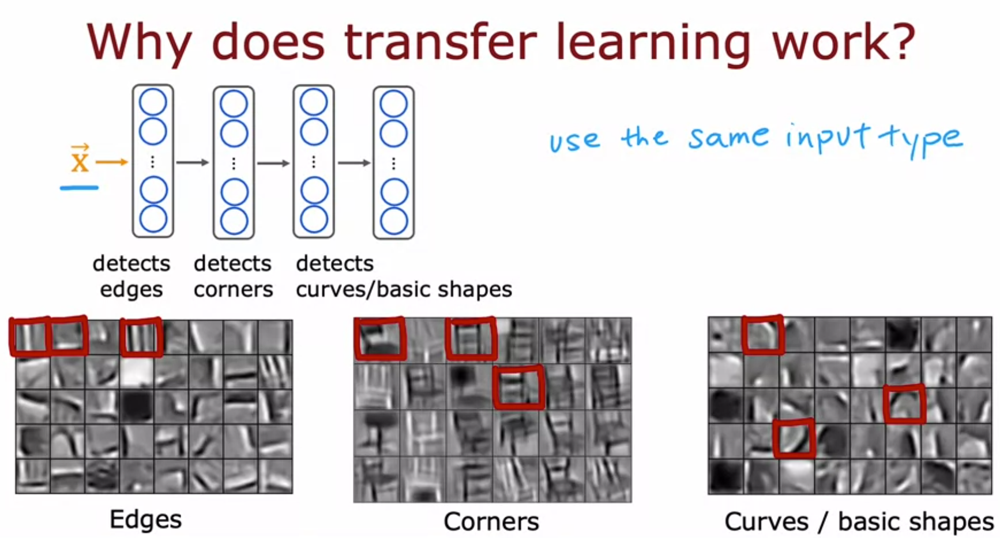
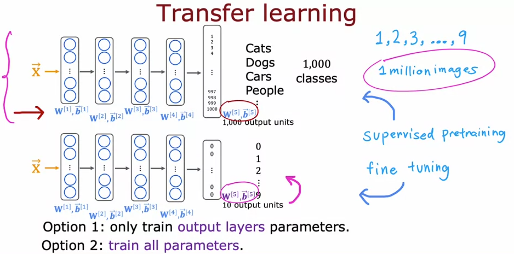

# Transfer Learning

Week notes from Andrew Ng ML Specialization. Andrew said he uses this one frequently. It is the solution to the "I don't have enough data" problem that comes up constantly in real projects.

## What Is It

Transfer learning is when you take a neural network that was already trained on a large dataset for some *other* task, and reuse most of it for your own task that has much less data.

The key word is "reuse." You are not training from scratch. You are borrowing a network that already learned useful things and just adjusting the last part.

## Why It Works

When a neural network is trained on millions of images (cats, dogs, cars, people, etc.), the early layers do not learn "cat-specific" things. They learn general visual primitives:

- Layer 1 learns to detect **edges**
- Layer 2 learns to detect **corners** (combinations of edges)
- Layer 3 learns to detect **curves and basic shapes**

These low-level features are useful for recognizing *any* image, not just the original task. A network trained on 1,000 object categories has essentially learned "how to look at images." That knowledge transfers.

So when you fine-tune on handwritten digits, the network already knows how to detect edges and curves. It just needs to learn how to combine those features into digits 0-9, which takes far less data and training time.

This also explains the one hard constraint: **the input type must match**. A network pre-trained on images is useful for other image tasks. Not for audio. A network pre-trained on audio is useful for other audio tasks. Not for text. The low-level features only transfer when the input domain is the same.

## How It Works

The concrete procedure using a handwritten digit recognition example:

**Step 1: Supervised pre-training**

Take a large neural network already trained on a big dataset (e.g. 1 million images, 1,000 classes). This network has layers W[1], b[1] through W[5], b[5].

**Step 2: Swap the output layer**

Delete the original output layer (1,000 units) and replace it with a new output layer sized for your task (10 units for digits 0-9). The new output layer W[5], b[5] cannot be copied because the dimensions changed. It gets initialized randomly.

**Step 3: Fine-tune**

Run gradient descent (or Adam) on your small dataset. Two options:

Option 1: Freeze all layers except the output layer. Only train W[5], b[5]. This makes sense when you have very little data. The earlier weights are kept exactly as they came from pre-training.

Option 2: Initialize all weights from pre-training, then train the entire network. This makes sense when you have more data. Pre-training just gives you a good starting point, and gradient descent adjusts everything from there.

If you have a small dataset, option 1. Slightly more data, option 2.

## The Practical Reality

You almost never need to do the pre-training step yourself. Researchers have trained massive neural networks on ImageNet, large text corpora, large audio datasets, and posted them online for free. GPT-3, BERT, ImageNet models, all of these are publicly available pre-trained networks.

You just download one, swap the output layer for your task, fine-tune on your own data, and you are done.

Andrew mentioned training networks on as few as 50 images and getting decent results because the pre-trained base was so strong. That is how powerful this technique is when the pre-training data is large enough.

## What This Means in Practice

If you ever have a small dataset and a task that involves images, audio, or text:

- Do not try to train from scratch. You will not have enough data.
- Find a pre-trained model for the same input type.
- Replace the output layer.
- Fine-tune.

This is now standard practice across almost all real ML projects. The community sharing pre-trained models freely is one of the reasons ML progress has been so fast. Someone spent weeks pre-training a model; you benefit from it in an afternoon.

