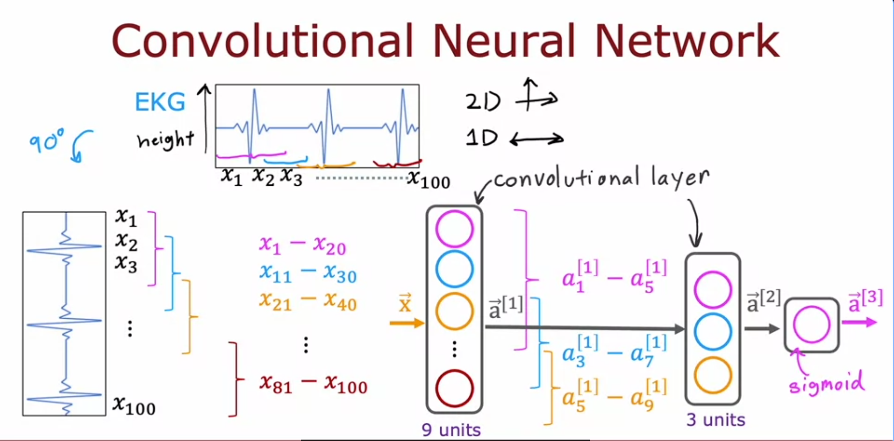

# Convolutional Neural Networks (CNNs)

## The Problem With Dense Layers

Every neuron in a dense layer gets every single activation from the previous layer as input. That seems fine until you think about it with a real input like an image or an EKG signal. If the image has a million pixels, every neuron has a million weights. That means:

- Way more parameters than needed
- More training data required to not overfit
- Slower to compute

The key insight is that most patterns in real data are **local**. A heartbeat spike in an EKG exists in a small window of the signal, not spread across all 100 timesteps. So why give every neuron access to all 100?

## The Convolutional Layer

Instead of connecting each neuron to everything, you restrict each neuron to only look at a small **window** of the input. That window is its entire world.

This is the convolutional layer. Each neuron has a limited receptive field and only processes what's inside it.

The image above (from the lecture) shows this clearly. The EKG signal is laid on its side as x1 to x100. Then in the first hidden layer (9 units), each neuron only looks at a chunk of that input, not all of it.

## The EKG Example Walkthrough

The lecture used EKG classification as the concrete example. Input is 100 values representing voltage over time. Goal is to detect whether the patient has heart disease.

**First convolutional layer has 9 units:**

Neuron 1 looks at x1 to x20. Neuron 2 looks at x11 to x30. Neuron 3 looks at x21 to x40. And so on until the last neuron which looks at x81 to x100. Each neuron only processes its assigned window.

**Second convolutional layer has 3 units:**

Now it operates on the activations from layer 1, not the raw input. Neuron 1 looks at a1[1] to a5[1], neuron 2 looks at a3[1] to a7[1], neuron 3 looks at a5[1] to a9[1].

**Output layer:**

A single sigmoid unit that takes all 3 activations from layer 2 and outputs a binary classification. Heart disease or not.

So the full architecture is: convolutional layer -> convolutional layer -> sigmoid output.

## Why the Windows Overlap

This confused me at first. Neuron 1 sees x1-x20 and neuron 2 sees x11-x30. They share x11-x20. Why not just do x1-x20, x21-x40 and keep things clean?

The reason is boundary patterns. If a heartbeat spike happens to fall between x19 and x22, a non-overlapping setup splits it across two neurons. Neither neuron sees the complete pattern. It could go undetected entirely.

With overlapping windows, that spike is guaranteed to be fully inside at least one neuron's window. The overlap is a coverage guarantee. No part of the signal is "half-seen."

The amount of overlap is controlled by the **stride** - how far you shift the window each time. A stride of 10 in this example (window size 20, shift by 10) gives 10-value overlap between adjacent neurons.

## Does Window Size Matter

Yes, it's one of the most important architectural decisions.

If the window is too small, each neuron sees too little to detect meaningful patterns. Think trying to identify a heartbeat by looking at 2 data points.

If the window is too large, you lose the whole point of local connectivity. A window that covers the entire input is just a dense layer again.

The right size depends on the scale of the patterns you care about. For EKG, 20 timesteps might be enough to capture a full heartbeat cycle. For 2D image data, 3x3 or 5x5 pixel filters are common because edges and textures are local features.

There is no universal answer. You pick based on domain knowledge and tune based on validation performance.

## Why This Actually Works

Three reasons convolutional layers are powerful and not just a gimmick:

**Fewer parameters.** A neuron with a window of 20 inputs has 20 weights. A dense neuron over 100 inputs has 100 weights. Scale this up across thousands of neurons and the difference is enormous. Fewer parameters means less data needed and less overfitting.

**Parameter sharing.** In practice, the same filter (set of weights) slides across the input. A filter that detects a sharp upward spike works the same whether that spike is at x5 or x75. You learn the pattern once, not separately for every position it could appear at. This is huge.

**Translation invariance.** Because the filter slides across, a pattern gets detected wherever it appears in the input. The model does not need to relearn "spike at position 20" and "spike at position 80" as separate things.

## When to Use CNNs vs Dense

Use convolutional layers when the input has **local spatial or temporal structure**. Images, audio, time series signals, text sequences. Nearby values carry related information. The pattern you care about could appear anywhere in the input.

Stick with dense layers when inputs are tabular with no meaningful spatial relationship between features, or when the input is small enough that parameter count is not a concern.

## Bigger Picture

CNNs are one example of a broader principle: you can design layer types specifically suited to your data structure instead of defaulting to dense everywhere. Transformers, LSTMs, attention mechanisms are all researchers doing the same thing - inventing new connectivity patterns for different kinds of data.

The lecture mentioned John LeCun as the researcher who figured out most of the details of how to make convolutional layers work in practice.

Stacking multiple convolutional layers is common. Early layers detect low-level local patterns (spikes, edges). Deeper layers combine those into higher-level features. That hierarchy of abstraction is part of why deep networks are powerful.
