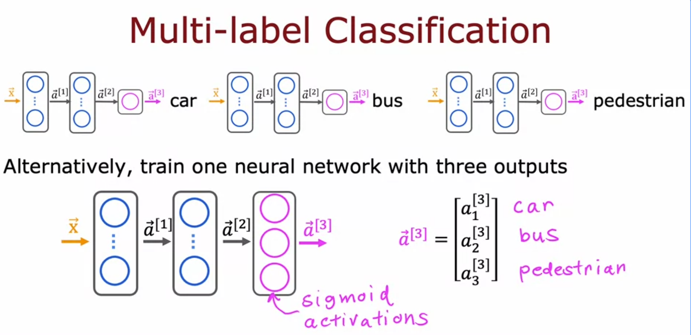

# Multi-Label Classification

Multiple classes can be correct at the same time.
Target is a vector (e.g., [1,0,1]).
Each output neuron answers an independent Yes/No question.
Each output uses a Sigmoid activation.
Probabilities do not need to sum to 1.
Loss: Binary Cross-Entropy computed independently for each output and then averaged or summed.
