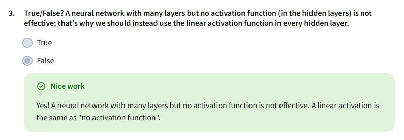

Why Neural Networks Need Activation Functions: A Simple Explanation

Imagine you have a recipe that only allows you to mix ingredients in a straight line—like adding sugar to flour and then adding more sugar to that mixture. No matter how many times you mix, the result is just a simple combination of sugar and flour. This is similar to what happens if a neural network uses only a linear activation function in every neuron: the whole network behaves like a simple linear equation, no matter how many layers it has. It can’t learn or represent anything more complex than a straight line.

Now, think of activation functions as special spices that add flavor and complexity to your recipe. When you use non-linear activation functions like ReLU, the neural network can mix ingredients in more interesting ways, creating rich and complex dishes (or in this case, learning complex patterns). This is why using non-linear activation functions in hidden layers is essential—it allows the network to understand and model complicated relationships in data, beyond just simple straight lines. 
