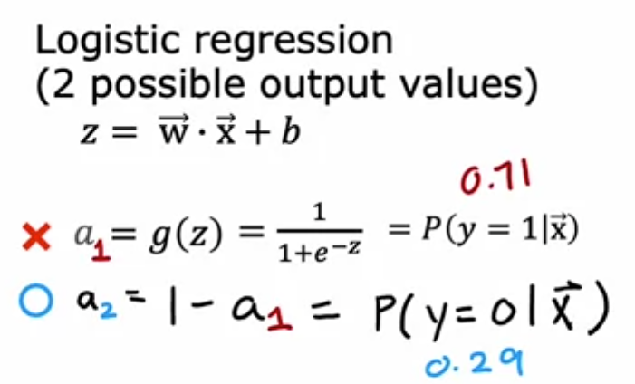
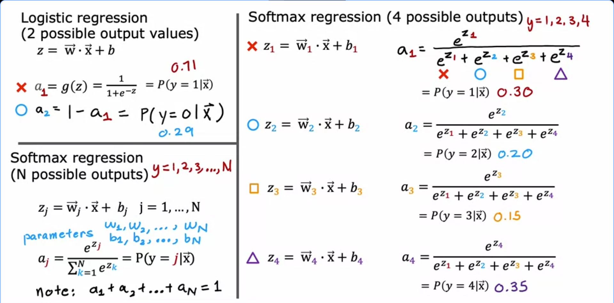

# Multi class classification problem
The problem is that Y which is the ground truth can have multiple values rather than being 1 or 0 which we were doing in Binary Classification using Sigmoig as activation function. 

The output we get after sigmoid was interpreted as " Probability of y = 1 given x features " and if we subtract from 1 then that tells us the probabilty of y = 0 given x features  
For example , if we are trying to predict animals there are so many Ground Truths or digits there are 9 digits not two . Thats why we cannot use logistic regression here. 

Softmax gives us the output which we can interpret as probabilty of Y = 1 given x features or Y = 2 or so on .
a_j is interpreted as the model's estmiate that y is equal to j given the input features x  
    When n = 2 then softmax regression model reduces to logistic regression

## What does w1,w2,w3,w4 mean? Put to put simply , each class has its own weights.
Let's assume every animal image has 5 features.

Feature 1 = Ear length
Feature 2 = Tail length
Feature 3 = Weight
Feature 4 = Height
Feature 5 = Fur density

Now suppose our classes are
1 = Cat
2 = Dog
3 = Horse
4 = Cow

Softmax learns one model for each class.

Instead of one weight vector , it learns Cat weights w1 ,Dog weights w2, Horse weights w3, Cow weights w4

Each one asks
"How much does this image look like MY class?"

Example
Cat weights may learn
Ear Length     +4
Tail Length    +2
Weight        -3
Height        -4

Dog weights might learn
Ear Length    +1
Tail Length   +4
Weight        +1
Height        +2

Horse weights
Ear Length    -3
Tail Length   -2
Weight        +6
Height        +8

Each class has its own opinion.

That is why there are w1,w2,w3,w4 instead of only one weight vector.
# Cost and Loss function for Softmax 

### The more confident the model is about the correct answer, the smaller the loss becomes
When prediction is correct then loss is small and all other classes are ignored

